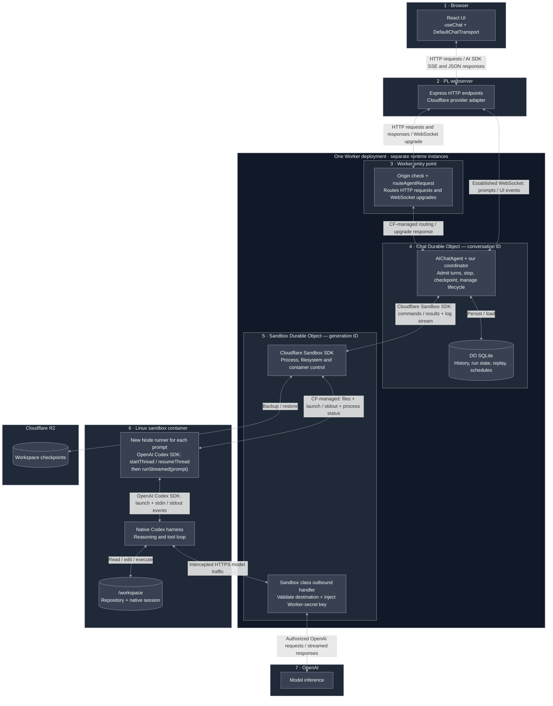
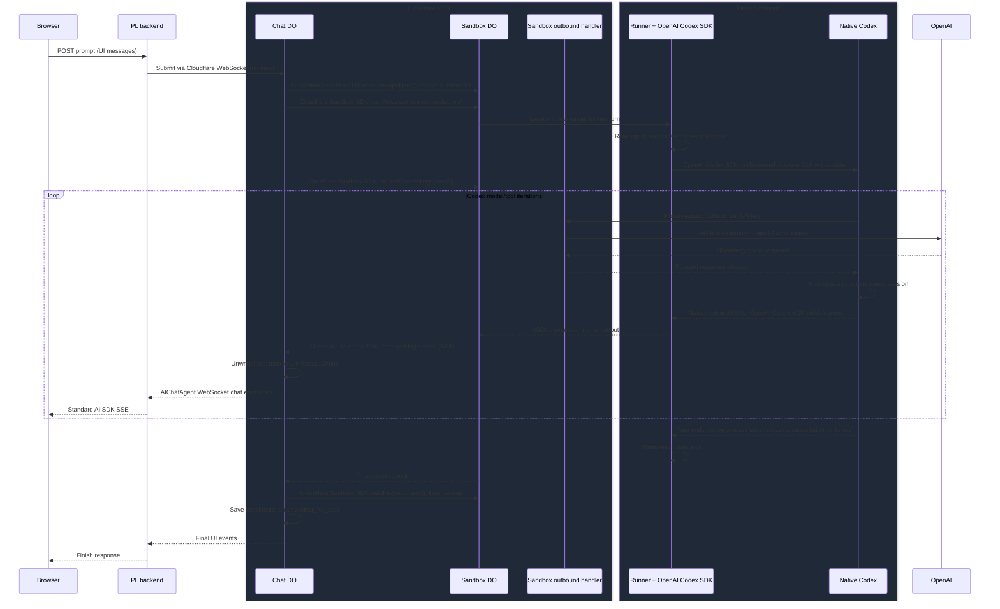
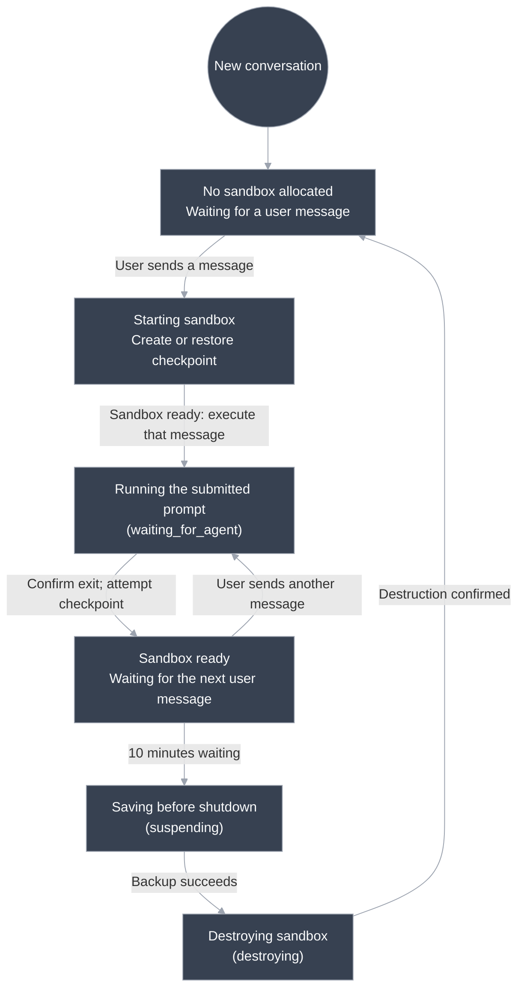

# Proposed persistent Codex architecture

A local React UI communicates through a replaceable Express server with native Codex running in a Cloudflare Sandbox. The conversation survives browser/server disconnection; workspace recovery uses checkpoints.

**Proposal only; no runtime changes.** Based on [the current architecture](architecture.md), with three changes: disable keep-alive, inject OpenAI credentials outside the container, and remove runner API-key redaction.

## Key decisions

- **Codex owns the Agent Loop.** One runner process per user prompt; subsequent prompts resume the native thread.
- **The Chat Durable Object (DO) owns coordination and history.** The PL server holds no durable execution state.
- **The browser uses standard AI SDK HTTP/SSE.** The backend adapter handles Cloudflare WebSockets.
- **Disconnection is not cancellation.** Reconnect to replay output; use Stop to cancel execution.
- **Recovery restores files, not running processes.** Interrupted prompts are never automatically repeated.

## Architecture

**One Worker deployment contains the entry point, Chat DO class, and Sandbox DO class.** DO instances have independent state and lifetimes; the Linux container runs separately.



The Worker routes HTTP requests and WebSocket upgrades; it is not our per-message relay after connection.

### How Cloudflare runs the chat agent

[Wrangler configuration](../apps/agent/wrangler.jsonc) points to `agent.ts`, binds `Chat` and `Sandbox` to exported DO classes, and registers their SQLite migrations. [The Worker module](../apps/agent/agent.ts) exports `Chat extends AIChatAgent` and the Sandbox class.

1. The PL backend requests `/agents/chat/playground`.
2. The Worker's `fetch()` calls `routeAgentRequest(request, env)`.
3. The Cloudflare Agents SDK selects the `Chat` binding and the named `playground` instance. Cloudflare creates or wakes that DO and delivers the request.
4. `AIChatAgent` handles the chat protocol and invokes our `onChatMessage()` override, which starts and observes a Codex turn.

No separate chat server startup is needed. In this proposal, the exported `Sandbox` becomes our Cloudflare Sandbox SDK subclass with an outbound handler; the `Sandbox` binding keeps its existing name.

### One turn: request and response

**The Chat DO launches and observes each turn. Native Codex owns the model/tool loop.**



**Process exit ends one turn, not the conversation.** A turn includes all model calls and tool actions for one user message. The runner records the outcome and exits; the sandbox can stay warm. The next message launches a new process that resumes the same native thread. Exit alone does not imply success.

**Input is file + process launch, not an open stdin connection between DOs.** Only the OpenAI Codex SDK writes native stdin, then closes it. Each new prompt launches a new runner; the sandbox and native session can stay warm across turns.

**Output has two streams:** native stdout is parsed by the OpenAI Codex SDK, then our runner emits JSONL to its own stdout. Cloudflare manages the buffered/live process-log SSE returned by `streamProcessLogs()`; we consume it with the Cloudflare Sandbox SDK’s `parseSSEStream()` helper. We do not implement an SSE endpoint between the DOs. Our mapper converts the log payloads for the UI. Codex never calls the Chat DO directly. Buffered logs cover output produced before the observer attaches.

Text is emitted on completed assistant items, not token by token. The mapper also handles commands and file changes; its Zod schema validates a subset of native events.

### Commands we run vs. SDK calls

| Operation                         | Our call                                                          | What executes                                                           |
| --------------------------------- | ----------------------------------------------------------------- | ----------------------------------------------------------------------- |
| Initialize a fresh workspace      | Cloudflare Sandbox SDK `exec()`                                   | `mkdir -p /workspace/repo /workspace/codex && git init /workspace/repo` |
| Launch one runner per prompt      | Cloudflare Sandbox SDK `startProcess()`                           | `node /opt/run-codex.mjs <run-directory>`                               |
| Start or resume the native thread | OpenAI Codex SDK `startThread()` / `resumeThread()`               | Sets up the thread handle inside the runner                             |
| Execute the prompt                | OpenAI Codex SDK `runStreamed(prompt, { signal })`                | Launches the native CLI, writes stdin, and yields parsed stdout events  |
| Observe runner output             | Cloudflare Sandbox SDK `streamProcessLogs()`                      | Returns the buffered/live process-log stream to the Chat DO             |
| Manage files and container        | Cloudflare Sandbox SDK file, backup, restore, and destroy methods | Cloudflare-managed sandbox operations                                   |

We do not construct a `codex exec` command. The OpenAI Codex SDK handles that subprocess. Native Codex chooses and executes its own tool commands, tests, and edits; the Chat DO does not orchestrate individual tool calls.

**Stop:** the Chat DO writes a cancel marker through the Cloudflare Sandbox SDK. The runner observes it and aborts the signal passed to `runStreamed()`; the OpenAI Codex SDK handles subprocess cancellation.

### Communication ownership

| Connection                        | We implement                                                                                                               | Library / platform handles                                                                             |
| --------------------------------- | -------------------------------------------------------------------------------------------------------------------------- | ------------------------------------------------------------------------------------------------------ |
| Browser ↔ PL backend              | Express endpoints and AI SDK configuration                                                                                 | AI SDK HTTP requests and SSE encoding/decoding                                                         |
| PL backend ↔ Chat DO              | Adapter opens the WebSocket, manages connection lifetime, forwards resume controls, and sends history/cancel HTTP requests | Cloudflare `WebSocketChatTransport` chat envelopes and chunk decoding                                  |
| Worker entry → Chat DO            | Call `routeAgentRequest`                                                                                                   | Cloudflare routing to the named DO                                                                     |
| Chat DO ↔ Sandbox DO/container    | Call Cloudflare Sandbox SDK methods; consume returned log events                                                           | Cloudflare-managed communication, process control, files, and backups; no custom HTTP/socket transport |
| Sandbox outbound handler ↔ OpenAI | Destination checks and authorization-header injection                                                                      | Cloudflare interception and streaming HTTP forwarding                                                  |
| Runner ↔ native Codex             | Call OpenAI Codex SDK thread and streaming methods                                                                         | OpenAI Codex SDK-managed subprocess and stdin/stdout protocol                                          |

**Chat DO ↔ Sandbox DO is Cloudflare-managed communication.** We call `getSandbox`, `writeFile`, `startProcess`, and `streamProcessLogs` through the Cloudflare Sandbox SDK. Cloudflare handles DO RPC and container transport. We own when to call them and how to map output, with no custom DO-to-DO HTTP endpoint or WebSocket.

The Cloudflare Sandbox SDK’s `parseSSEStream` helper unwraps process-log events. Our `CodexEvents` mapper translates their JSONL payload into AI SDK UI events. **We own the event translation, not the sandbox transport.**

### Code ownership

| Surface                                                                                                        | We own                                                           | Library/service owns                                                  |
| -------------------------------------------------------------------------------------------------------------- | ---------------------------------------------------------------- | --------------------------------------------------------------------- |
| [React client](../apps/web/client/App.tsx)                                                                     | Transcript UI, history loading, reconnect, Stop                  | AI SDK message state and SSE consumption                              |
| [Express relay](../apps/web/server/server.ts) + [provider adapter](../apps/web/server/providers/cloudflare.ts) | Routes, validation, connection lifetime                          | Express HTTP; Cloudflare chat transport; AI SDK SSE encoding          |
| [Chat coordinator](../apps/agent/agent.ts)                                                                     | Admission, cancellation, lifecycle, checkpoint ordering          | `AIChatAgent` history/replay; Agents durable scheduling               |
| [Sandbox bridge](../apps/agent/codex.ts) + [event mapper](../apps/agent/codex-events.ts)                       | Process/file calls and Codex → UI translation                    | Sandbox execution, log streaming, backup/restore                      |
| [Runner](../apps/agent/run-codex.mjs)                                                                          | Input/result files, duplicate-launch claim, cancellation watcher | Official OpenAI Codex SDK subprocess handling; native model/tool loop |

## Request contract

The [shared contract](../packages/chat-contract/src/index.ts) defines these provider-independent operations using AI SDK message types:

| Endpoint                          | Behavior                                                              |
| --------------------------------- | --------------------------------------------------------------------- |
| `POST /api/chat`                  | Validate `UIMessage[]`, submit through the adapter, return AI SDK SSE |
| `GET /api/chat/history`           | Return persisted UI messages                                          |
| `GET /api/chat/playground/stream` | Attach to buffered/live output; 204 if none                           |
| `POST /api/chat/cancel`           | Request explicit stop; report unconfirmed cleanup as an error         |

The coordinator sends only the latest user text to `runStreamed`; native session files carry previous context. A **turn** includes every model call and tool action for that prompt. The runner exits after the turn.

The adapter uses `cancelOnClientAbort: false`. Replacing the relay requires only the same `AGENT_URL`; reconnection does not resubmit the prompt.

## Global state machine

A new conversation starts without a sandbox. Opening the chat does not start Codex; sending a message triggers startup. This diagram shows the normal path; failure behavior follows.



### Lifecycle rules

| Trigger                  | Behavior                                                                                           |
| ------------------------ | -------------------------------------------------------------------------------------------------- |
| New message              | Reuse a warm sandbox or restore a cold one; reject overlapping turns                               |
| Turn ends                | Confirm exit, save native thread ID, attempt checkpoint, enter `waiting_for_user`                  |
| Stop                     | Runner aborts the OpenAI Codex SDK signal; wait up to five seconds for exit, without force-killing |
| Ten minutes waiting      | Checkpoint, then destroy; a new turn invalidates the old idle timer                                |
| Six-hour sandbox age     | Abort observation and destroy, even mid-turn, without requiring a fresh checkpoint                 |
| Browser/relay disconnect | No execution or lifecycle transition                                                               |

`keepAlive: false` applies during work and waiting, with no application toggles. `sleepAfter: "6h"` is an idle timeout, not a maximum turn duration; active requests or log streams can prevent idleness. The existing runner timeout, process timeout, and durable destruction still enforce the absolute six-hour deadline; new turns do not reset it.

Only `offline` and `waiting_for_user` normally accept new work. Stopping and turn-end checkpointing remain within `waiting_for_agent`. Run outcomes (`completed`, `cancelled`, `failed`, `interrupted`) are separate from sandbox phases.

### Failure behavior

| Failure                               | Recovery                                                                                |
| ------------------------------------- | --------------------------------------------------------------------------------------- |
| Stop unconfirmed                      | Keep run active; block new turns until confirmed exit or lifetime cleanup               |
| Turn-end backup fails                 | Report error; preserve warm workspace and previous checkpoint                           |
| Idle backup/destruction fails         | Return to waiting; at most three attempts, 30 seconds apart                             |
| Lifetime destruction fails            | Record `cleanup_failed`; same bounded retries, then explicit retry on a new message     |
| Chat DO restarts mid-turn             | Stop surviving work and checkpoint when possible; no automatic prompt replay            |
| Container or output stream disappears | Report interruption/failure and attempt cleanup; cold recovery uses the last checkpoint |
| Restore fails or backup expires       | Surface error; no automatic reconstruction from chat history                            |

Destruction must be confirmed before intentionally replacing a generation. Timers check the generation ID; idle timers also check `waitingSince`. Late callbacks/backups cannot overwrite a replacement's state. An unexpected cold restart does not extend the recorded lifetime. Cloudflare outages can delay destruction; there is no separate cleanup sweeper.

## Persistence

| Data                                                                     | Location                                 | Survives container loss?                |
| ------------------------------------------------------------------------ | ---------------------------------------- | --------------------------------------- |
| UI history, replay, latest run, generation, schedules, checkpoint handle | Chat DO SQLite (not D1 or PL PostgreSQL) | Yes                                     |
| Repository and native Codex session                                      | `/workspace/repo`, `/workspace/codex`    | Only through a successful R2 checkpoint |
| Runner input, claim, cancel marker, result, diagnostics                  | `/tmp`                                   | No                                      |
| Workspace backups                                                        | R2                                       | Yes, until expiry                       |

Checkpoints pair workspace files with their native thread ID. The thread ID alone cannot restore a conversation. Backups happen after confirmed stop and before idle destruction; no shutdown hook is assumed to save work on abrupt loss.

**UI history and workspace backups are not atomic.** After recovery, history may describe edits absent from the last checkpoint. Launch claims prevent common duplicate execution in a surviving container; they do not provide exactly-once tool side effects.

Backups expire after **30 days**; an R2 lifecycle rule must delete old objects. This differs from the Course agent MVP's seven-day policy.

## Proposed credential boundary

**The Sandbox class owns the outbound handler, not the Chat DO.** Cloudflare executes it in the Workers runtime outside the Linux container. It is not another process we run inside the box. The Chat DO still launches turns and consumes output; it does not relay model requests.

- Subclass the Cloudflare Sandbox SDK's `Sandbox` class and configure its outbound handler. Use Cloudflare's outbound interception and `ContainerProxy` integration rather than building an HTTP server in the container.
- Keep the real OpenAI key in a Worker secret. Remove it from runner environment variables, input files, and Codex configuration.
- Allow only the intended OpenAI host and API routes for credential injection. Replace incoming authorization, reject unexpected destinations, and prevent authenticated redirects to other hosts.
- Forward request bodies and response streams without interpreting model events. Codex continues to own the model/tool loop.

[Cloudflare outbound traffic documentation](https://developers.cloudflare.com/sandbox/guides/outbound-traffic/).

### Sample outbound handler

Illustrative Worker code using the [documented Sandbox outbound API](https://developers.cloudflare.com/sandbox/guides/outbound-traffic/). Cloudflare Sandbox SDK version compatibility and Codex integration still need verification. This replaces the direct Cloudflare Sandbox SDK `Sandbox` re-export; it does not run inside the container.

```ts
import { Sandbox as CloudflareSandbox } from "@cloudflare/sandbox";
export { ContainerProxy } from "@cloudflare/sandbox";

type OutboundEnv = { CODEX_API_KEY: string };

export class Sandbox extends CloudflareSandbox {
  enableInternet = false;
  allowedHosts = ["api.openai.com"];
}

Sandbox.outboundByHost = {
  "api.openai.com": (request: Request, env: OutboundEnv) => {
    const url = new URL(request.url);
    const allowedPath =
      url.pathname === "/v1/responses" ||
      url.pathname === "/v1/responses/compact";
    if (
      url.protocol !== "https:" ||
      url.host !== "api.openai.com" ||
      request.method !== "POST" ||
      !allowedPath
    ) {
      return new Response("Forbidden", { status: 403 });
    }

    const upstream = new Request(request, { redirect: "error" });
    upstream.headers.set("Authorization", `Bearer ${env.CODEX_API_KEY}`);
    return fetch(upstream);
  },
};
```

The example allows only Responses/compaction POSTs and blocks other internet destinations. Confirm the routes used by our Codex version; add package/repository hosts explicitly if needed. The response body remains streamed. Configure Codex for HTTP streaming through this path and verify HTTPS certificate trust.

The Chat DO obtains the sandbox as before, with keep-alive disabled:

```ts
const sandbox = getSandbox(this.env.Sandbox, sandboxId, {
  keepAlive: false,
  sleepAfter: "6h",
});
```

For a later `push_sync` PR, use another narrowly scoped handler with its own credential and destination policy. Validate the sandbox's repository permissions using trusted context such as `ctx.containerId`; container-supplied URLs must not choose where a credential is sent. No `push_sync` implementation is included here.

**Verify before implementation:** the installed Cloudflare Sandbox SDK's interception support, Codex's authentication requirements without a real local key, trust for Cloudflare's HTTPS interception certificate, and streaming/cancellation behavior. A placeholder credential may be needed by the client; it must have no value outside the proxy.

This isolates the real key from container files and stdout. Container code can still make requests permitted by the handler and consume model usage; key isolation does not replace authorization or spending limits. **Remove the runner's API-key sanitization pass:** JSONL remains the event format, but the runner never receives the key to redact. The handler must not log or return its injected authorization header. The Chat DO does not read or pass the key; the secret remains available only to trusted Worker code, not container code. Other secrets and sensitive content can still appear in logs or checkpoints.

## Known gaps

**Trusted prototype only:** one shared `playground` conversation, one configured container instance, an initially empty Git repository, and no application authentication. Origin checks are not authorization.

- Two simultaneous chat windows through different relays remain **untested**; idle windows do not automatically discover new turns elsewhere.
- No course checkout/sync, publishing approvals, preview servers, or usage accounting.
- Live container execution, cancellation, R2 restoration, and lifecycle alarms still require verification. Backup cost/latency and warm-session artifact growth are unmeasured.

## Deployment and replacement

**Two deployments:** `apps/web` serves React and Express; `apps/agent` deploys the Worker, DO classes, and container image. `packages/chat-contract` is shared source, not a service. [Deployment instructions](../README.md#cloudflare-setup--you-perform-these-steps).

To replace Cloudflare, implement the same history/send/resume/cancel provider interface and replace `apps/agent`. Preserve durable history, subscriber-independent execution, reattachment, cancellation, and workspace recovery. The frontend can stay; the adapter and persisted data require migration.

## Validation

The proposed changes have no runtime test coverage yet. Verify that the real key is absent from container environment/files/output, forbidden destinations cannot receive it, model streaming and cancellation work, and idle shutdown permits checkpoint recovery.

[Codex tests](../apps/agent/test/codex.test.ts) cover mapping, runner subprocess behavior, cancellation, and remaining-lifetime timeouts. [Relay integration tests](../apps/web/test/relay.mjs) use the real local chat runtime with a deterministic sandbox fixture for reconnection, restoration, lifecycle, stale timers, and failure handling. Clock advancement tests policy, not actual six-hour cloud execution.

Run `pnpm test`; complete the [live acceptance steps](../README.md#try-it) before relying on the deployment. The broader [Course agent MVP](https://github.com/PrairieLearn/PrairieLearn/issues/15681) remains future work, particularly durable approval/publishing flows across sandbox loss.
