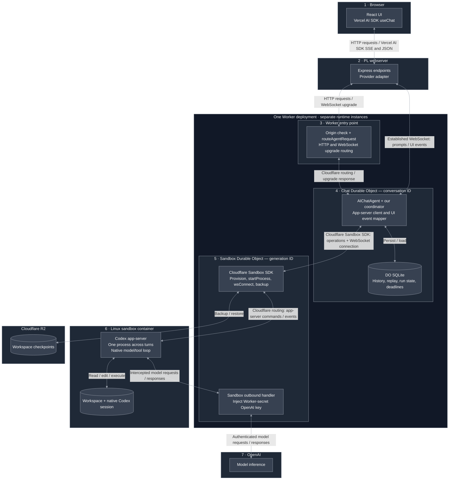
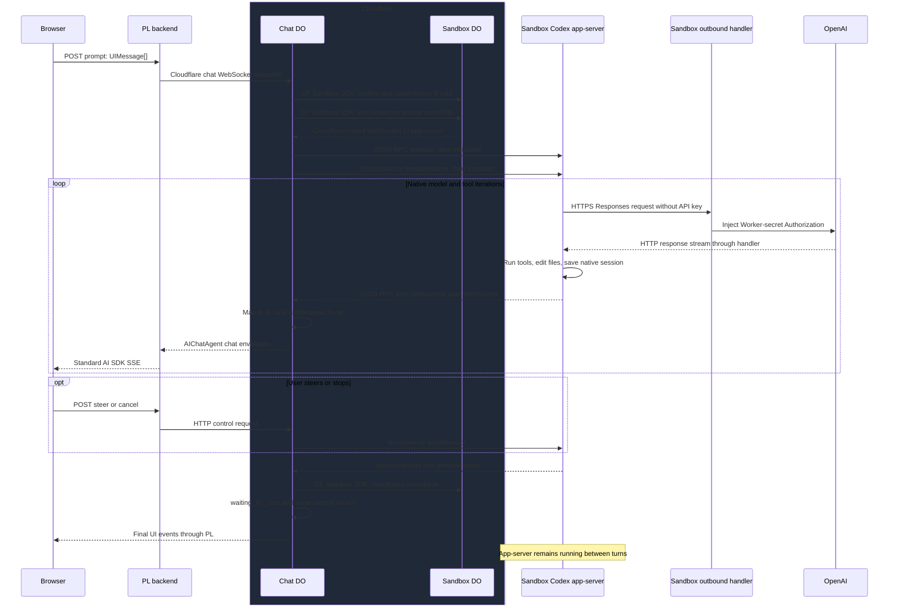
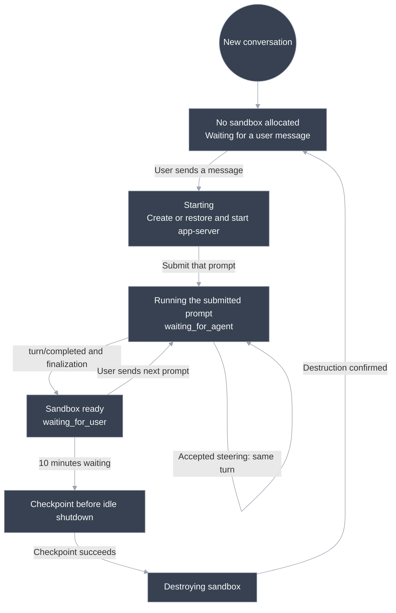

# Persistent Codex architecture

React/AI SDK → stateless PL relay → Chat Durable Object → Codex app-server in a Cloudflare Sandbox. Native Codex owns the model/tool loop. The Chat DO owns admission, UI history, lifecycle, and recovery.

**Implemented locally.** Tests cover the real app-server with a fake model endpoint and the real Cloudflare chat runtime with a simulated sandbox. Live outbound credential injection, container isolation, and R2 restore still need deployment verification. [Setup](../README.md).

## Components and boundaries

The Worker entry point, Chat class, and Sandbox class are deployed together. Each DO instance has its own state/lifetime; the Linux container is a separate runtime.



Wrangler registers the exported DO classes and bindings. PL connects to `/agents/chat/playground`; `routeAgentRequest` selects that named Chat DO, and Cloudflare instantiates it as needed. `AIChatAgent` receives chat messages, persists history/replay in the DO's SQLite, and invokes our `onChatMessage`. The Worker routes the initial request/upgrade; we do not relay every WebSocket frame through another Worker handler.

### One turn: commands and responses



The diagram's Chat ↔ Codex arrows use the socket returned by Cloudflare's Sandbox SDK. **Cloudflare owns DO RPC and container routing. We own JSON-RPC request matching and event conversion.** No stdout parsing, per-turn runner, cancellation marker, or Codex TypeScript SDK remains.

| Surface                                                                                           | Our code                                                       | Delegated                                                        |
| ------------------------------------------------------------------------------------------------- | -------------------------------------------------------------- | ---------------------------------------------------------------- |
| [Browser](../apps/web/client/app.tsx)                                                             | Small UI, history/reconnect, Stop/steer                        | AI SDK message state and SSE                                     |
| [PL relay](../apps/web/server/server.ts) / [provider](../apps/web/server/providers/cloudflare.ts) | Routes, validation, connection lifetime                        | Express, Cloudflare chat transport, AI SDK SSE                   |
| [Chat DO](../apps/agent/agent.ts)                                                                 | Turn admission, durable deadlines, checkpoints, reconciliation | AIChatAgent history/replay, Agents scheduling                    |
| [Sandbox bridge](../apps/agent/codex.ts)                                                          | Start/reuse process, connect, backup/restore calls             | Cloudflare Sandbox SDK                                           |
| [App-server client](../apps/agent/app-server.ts) / [mapper](../apps/agent/codex-events.ts)        | Request IDs, notifications → UI events                         | Generated native protocol types; Codex thread/turn and tool loop |
| [Sandbox policy](../apps/agent/sandbox.ts) / [outbound handler](../apps/agent/outbound.ts)        | Allowed hosts and credential injection                         | Cloudflare outbound interception                                 |

## Commands we run

Cold startup creates/restores `/workspace`, copies the [Codex config](../apps/agent/codex-config.toml), and launches:

```sh
codex app-server --listen ws://0.0.0.0:4500 \
  --ws-auth capability-token --ws-token-file /tmp/codex-app-server-token
```

The process receives `CODEX_HOME=/workspace/codex`, **no OpenAI API key**. The private control token is separate from model credentials and excluded from backups. Readiness and protocol initialization complete before a turn is submitted.

Subsequent prompts use `thread/resume` and `turn/start`; steering uses `turn/steer` with the expected turn ID; Stop uses `turn/interrupt`. App-server stays running. A turn includes all model and tool steps until `turn/completed`, not just one tool call. Close the control socket after finalization; reconnect for the next prompt.

[protocol.ts](../apps/agent/protocol.ts) is generated from pinned Codex **0.155.0**. The client checks JSON-RPC envelopes; payload types trust this authenticated, version-pinned endpoint. It is not full runtime schema validation. WebSocket app-server transport is experimental upstream.

## Lifecycle

A new chat starts without a sandbox. **The user sends the first prompt; startup runs that pending prompt.**



| Timer                            | Reset by                                       | Action                                                       |
| -------------------------------- | ---------------------------------------------- | ------------------------------------------------------------ |
| Six hours since user interaction | Accepted prompt, steering, or active-turn Stop | Durable alarm: bounded interruption/checkpoint, then destroy |
| Ten minutes waiting for user     | Next turn invalidates the waiting period       | Checkpoint, then destroy                                     |
| Cloudflare `sleepAfter: "6h"`    | Activity recognized by the container interface | Infrastructure idle shutdown; `keepAlive: false`             |

There is **no absolute sandbox-age cap and no per-turn process timeout**. Steering can extend the same turn beyond six hours. Model/tool output, history reads, reconnects, and duplicate/rejected steering do not reset the application deadline. Agents `schedule()` persists callbacks; generation IDs and timestamps reject stale callbacks.

An open proxied control WebSocket prevents Cloudflare idle expiry in the installed container library. Local file/CPU activity alone is not an idle reset. Our application alarm bounds active work even while the socket remains open.

| Failure                                           | Behavior                                                                                                                          |
| ------------------------------------------------- | --------------------------------------------------------------------------------------------------------------------------------- |
| Stop acknowledgment without terminal notification | Wait up to five seconds after acknowledgment, report unconfirmed Stop; keep new turns blocked                                     |
| Connection/DO lost after submission               | Reconnect and inspect the native thread; stop surviving work before admitting another turn; never replay the prompt automatically |
| Container/process lost                            | Destroy the old generation, report interruption; a user prompt can restore the last checkpoint                                    |
| Turn-end backup fails                             | Report failure; retain warm workspace and previous checkpoint                                                                     |
| Pre-idle backup fails                             | Return to waiting and retry; do not destroy without that backup                                                                   |
| Destruction fails/unknown                         | Retain generation as `cleanup_failed`; block replacement                                                                          |
| Cleanup retry budget exhausted                    | Three total attempts, 30 seconds apart; next prompt may explicitly retry                                                          |
| Restore fails/backup expired                      | Surface the error; do not invent native context from UI history                                                                   |

The six-hour deadline attempts interruption for at most five seconds and a final backup for at most ten seconds, then destroys regardless. Ordinary checkpoints are awaited before another turn can start. Destruction confirmation is bounded to 30 seconds; a timeout is an uncertain result, not proof of destruction. Cloudflare outages can delay cleanup.

Run outcomes (`completed`, `cancelled`, `failed`, `interrupted`) are separate from sandbox phases. Browser/PL disconnection changes neither lifecycle nor execution. App-server recovery does not promise replay of every missed tool event; UI history receives a terminal result/interruption after reconciliation.

## Persistence and credentials

| Data                                                       | Storage                                      |
| ---------------------------------------------------------- | -------------------------------------------- |
| UI messages, stream replay, run/thread/turn IDs, deadlines | Chat DO SQLite                               |
| Native model context + repository                          | `/workspace/codex` + `/workspace/repo`       |
| Workspace/session recovery                                 | R2 checkpoints, paired with native thread ID |
| Control token + diagnostics                                | `/tmp`, outside checkpoints                  |
| OpenAI credential                                          | Worker secret, used only by outbound handler |

Checkpoints happen after terminal turns and before idle destruction. They save files, not a live process. Native app-server remains running; backup consistency with its background metadata writes still needs live verification. UI history and backups are not atomic; history may describe work missing from a restored checkpoint. Backups expire after 30 days; configure R2 deletion separately.

The Sandbox subclass allows `api.openai.com` and the configured R2 account host. For OpenAI it permits only HTTPS POSTs to `/v1/responses` and `/v1/responses/compact`, replaces Authorization, strips container-supplied project/organization headers, and rejects redirects. Codex uses HTTP Responses with model WebSockets disabled. Cloudflare's SDK uses presigned URLs for R2 transfer; permanent R2 keys remain Worker secrets. Other internet destinations are blocked, including package/Git hosts until explicitly added.

No OpenAI-key redaction pipeline is needed because the key is never sent into the container. This does not sanitize unrelated secrets in prompts/files or impose spending limits. Legacy credential paths remain excluded from backups; previous backups are not scrubbed retroactively. The app-server control token is container-readable and protects the private socket, not the model account.

## Scope and verification

Two deployments: `apps/web` and `apps/agent`; the shared chat contract is source code, not a service. Preserve history/send/resume/cancel/steer and AI SDK events when replacing Cloudflare; replace the provider adapter and migrate state.

- Trusted disposable prototype: one shared conversation, no user authentication/approval UI. Origin checks are not authorization.
- Two-window synchronization remains a gap. Course checkout/push_sync, previews, usage accounting, and checkpoint-frequency optimization are deferred.
- Unit tests cover protocol matching, mapper behavior, and outbound policy. Integration tests exercise real AIChatAgent/relay behavior against a simulated sandbox. The native test runs pinned app-server against a fake local model endpoint.
- Live acceptance still requires Cloudflare HTTPS interception/TLS trust, workspace sandbox/tool execution, private socket authentication, and real R2 backup/restore. No deployment or paid inference is included in local checks.

References: [Codex app-server](https://learn.chatgpt.com/docs/app-server), [Cloudflare WebSockets](https://developers.cloudflare.com/sandbox/guides/websocket-connections/), [outbound handlers](https://developers.cloudflare.com/sandbox/guides/outbound-traffic/), [backups](https://developers.cloudflare.com/sandbox/guides/backup-restore/).
