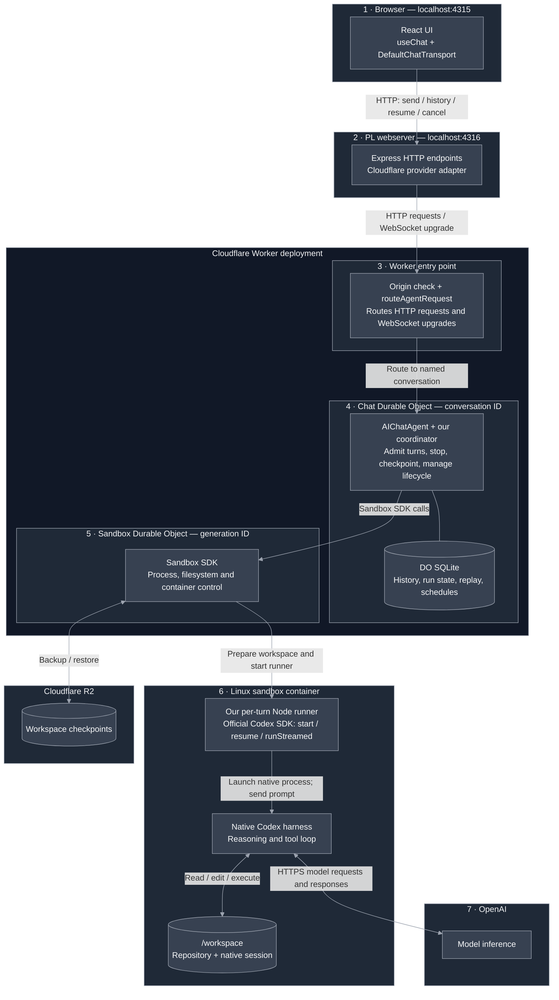
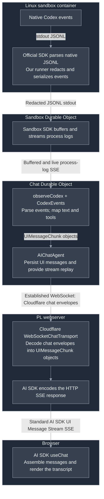
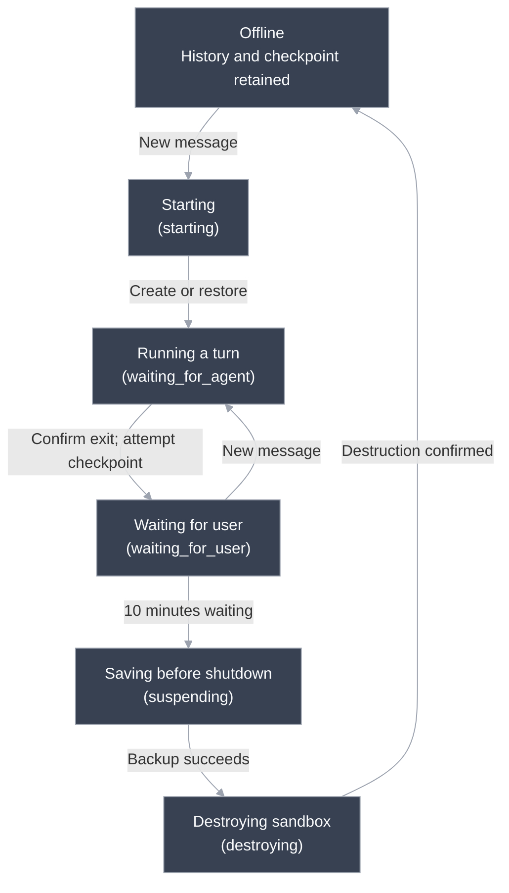

# Persistent Codex agent prototype: architecture and lifecycle

This document describes the implementation in `cloudflare-agents-sdk-test`. It follows the structure of [Course agent MVP, PrairieLearn #15681](https://github.com/PrairieLearn/PrairieLearn/issues/15681), but covers the smaller system built here: a persistent coding conversation, a replaceable local webserver, and a restorable Cloudflare Sandbox running native Codex.

**Status:** the local implementation includes the Express relay, ten-minute waiting-state suspension, and six-hour sandbox lifetime policy. Local fixtures exercise the coordinator and transports. Deployment, real model execution, and real Cloudflare container/R2 acceptance remain user-run. This document does not claim the full Course agent MVP is implemented.

Use the [README](../README.md#cloudflare-setup--you-perform-these-steps) for setup commands. This document explains the boundaries, state transitions, persistence, and failure behavior another engineer needs to change the system.

## Goal and scope

Prove this end-to-end workflow with as little application code as practical:

1. A user opens a local React page and sends a coding request through a local backend.
2. A Cloudflare conversation coordinator creates or restores a sandbox.
3. Native Codex edits files and runs tools inside that sandbox, calling OpenAI for model inference.
4. The user sees assistant messages and tool activity through the standard AI SDK message stream.
5. The browser can disconnect, or the local backend can be replaced, while the turn continues.
6. A new connection retrieves history and attaches to the current response without repeating the prompt.
7. The user can explicitly stop a turn and continue the same native conversation with another message.
8. An idle sandbox is backed up and destroyed. The next message restores the workspace and Codex session.
9. An old sandbox is destroyed at its lifetime deadline, even during work. A later message restores the last successful checkpoint.

The prototype has one shared conversation, `playground`, and a maximum of one container instance in its deployment configuration. The workspace starts as an empty Git repository. It is not a configured PrairieLearn course checkout.

Outside this increment: PL authorization, multiple users/courses, approval-gated publishing, Course Sync, controlled credential-injecting egress, usage accounting, preview web servers, and transparent continuation of interrupted work. No OpenAI Agents API, Codex app-server, custom reasoning loop, or container HTTP application is used.

## Architecture

### 1. Components and execution

Read from top to bottom. Each dark-gray region is a runtime or service; the Worker entry point and both Durable Objects belong to one Cloudflare Worker deployment. Storage branches sit beside the components that use them. The response conversion pipeline is shown separately below.

### 2. Results back to the browser

This is the return path through the same components, not a second set of services. The public Worker entry point is omitted because it does not run our per-message forwarding loop after the WebSocket is established.

The browser only calls the PL-style backend. In local development, Vite proxies `/api` from port 4315 to Express on port 4316. Cloudflare does not serve the page.

The public Worker routes the initial HTTP request or WebSocket upgrade to the named Chat DO. Our `fetch` handler is not a per-message forwarding loop. Once the socket is established, Cloudflare dispatches its messages to the Chat DO. A Worker isolate is runtime-managed; completing `fetch` does not mean the deployment or conversation is destroyed.

The Chat DO owns application policy. The separate Sandbox DO is the SDK's container-control object, selected by a sandbox generation UUID. Our Chat class calls its APIs; it does not implement another container supervisor. Sandbox identity can change while the conversation's Chat DO stays the same.

The Codex reasoning/tool loop runs inside the container. The Chat DO observes its output and manages when execution is allowed; it does not choose the next tool or issue model requests itself.

### Ownership

| Component          | Application code we own                                                                             | Behavior delegated to a library or service                                                                 |
| ------------------ | --------------------------------------------------------------------------------------------------- | ---------------------------------------------------------------------------------------------------------- |
| Browser            | Barebones form/transcript, initial history load, reconnect effect, explicit Stop request            | AI SDK `useChat` state, message assembly, HTTP/SSE transport and stream resumption call                    |
| PL-style backend   | Express routes, request validation, provider selection, subscriber lifetime                         | Express HTTP handling; AI SDK SSE encoding                                                                 |
| Cloudflare adapter | Connection lifetime, resume control-event forwarding, history/cancel HTTP requests                  | `WebSocketChatTransport` chat envelopes and chunk decoding                                                 |
| Worker entry point | Public route allowlist and origin/CORS policy                                                       | `routeAgentRequest` routing to the named DO                                                                |
| Chat DO            | One-turn admission, sandbox generation state, stop/recovery policy, deadlines, checkpoint ordering  | `AIChatAgent` chat protocol, transcript persistence, response replay and recovery hooks; Agents scheduling |
| Sandbox bridge     | Calls to prepare, start, observe, stop and checkpoint; Codex-to-UI event mapping                    | Sandbox SDK process management, process-log streaming, file operations and backup/restore                  |
| Runner             | Input/result files, launch claim, cancellation marker watcher, deadline signal, known-key redaction | Official Codex SDK thread start/resume, subprocess invocation and native event decoding                    |
| Native Codex       | Configuration only                                                                                  | Model/tool loop, commands, edits, native conversation files and compaction                                 |
| Infrastructure     | Deployment configuration and lifecycle policy                                                       | Cloudflare execution/storage, R2 archives, OpenAI inference                                                |

## User experience and request flow

The UI displays a transcript, tool details, Send, Stop, and a reconnect/history-refresh action. Its “Working” or “Ready” indicator describes the browser transport, not an authoritative sandbox lifecycle state. A passive second tab does not continuously subscribe to turns started elsewhere; refresh or reconnect it.

### Send a message

1. `useChat` sends AI SDK `UIMessage[]` to `POST /api/chat`.
2. Express enforces the JSON body limit, validates the request envelope and messages, and opens a provider connection.
3. The adapter opens a WebSocket to `/agents/chat/playground`. The Worker routes it to `Chat("playground")`.
4. `AIChatAgent` handles the chat request and invokes our `onChatMessage`. Our code extracts text from the latest user message. It sends only that prompt to Codex; it does not replay the UI transcript into the native thread.
5. The coordinator rejects overlapping work and a repeated attempt for its currently recorded message ID. It persists a run ID and sandbox generation before launch. A new generation gets a durable lifetime callback before paid work starts.
6. `prepareSandbox` reuses a ready workspace, restores the last checkpoint if cold, or initializes an empty Git repository. The runner starts or resumes the matching native thread.
7. The runner consumes `runStreamed(prompt, { signal })`. Codex may execute many reasoning/model/tool steps before this one turn ends.
8. The DO consumes buffered and live process output, maps supported items to AI SDK chunks, and returns them through `AIChatAgent`. The relay encodes those chunks as SSE for the browser.
9. After confirmed process exit, the coordinator records the native thread ID, saves a workspace checkpoint, enters `waiting_for_user`, and schedules idle suspension. Keep-alive stays enabled until explicit cleanup.

A **turn** is the whole response to one user prompt, including all model calls and tools it triggers. A tool call is not a new turn and does not reset sandbox age.

### History, reconnection and Stop

| Browser/backend endpoint          | Result                                                    | Upstream operation                                |
| --------------------------------- | --------------------------------------------------------- | ------------------------------------------------- |
| `GET /api/chat/history`           | JSON `UIMessage[]`                                        | HTTP `GET /agents/chat/playground/get-messages`   |
| `POST /api/chat`                  | AI SDK UI Message Stream SSE                              | WebSocket chat submission                         |
| `GET /api/chat/playground/stream` | Replay/live SSE, or HTTP 204 if no stream                 | WebSocket resume through the Cloudflare transport |
| `POST /api/chat/cancel`           | HTTP 204 after confirmed stop handling; failure otherwise | HTTP `POST /agents/chat/playground/cancel`        |

Closing the HTTP response aborts its subscriber connection. The adapter uses `cancelOnClientAbort: false`, so subscriber cancellation does not become execution cancellation. A replacement webserver needs the same `AGENT_URL`; it does not recover any local durable state.

On a broken stream, the browser reloads saved history and calls `resumeStream`. Reattaching to a response is different from asking Codex to execute the prompt again. The former is supported; automatic prompt replay is deliberately disabled.

Stop is an explicit command. The DO writes a cancel marker; the runner's filesystem watcher aborts the SDK signal. The coordinator waits up to five seconds for confirmed process exit. That wait is a stop-confirmation limit, not a normal turn limit. An unconfirmed stop reports an error and blocks another turn; normal Stop does not escalate to a forced kill. Once stopped and checkpointed, a later message resumes the same native thread.

## Global state machine

The **Chat DO** owns this lifecycle. The normal path is below; exceptions are listed separately to keep the diagram readable. Labels in parentheses are the stored sandbox phases. `offline` means no sandbox is allocated.

Exceptions:

- **Six-hour lifetime:** any allocated state goes to `destroying`, without waiting for a fresh backup.
- **Stop:** remain in `waiting_for_agent` until process exit is confirmed. An unconfirmed stop blocks new turns. A failed end-of-turn checkpoint is reported, but the stopped sandbox can still enter `waiting_for_user`.
- **Idle cleanup fails:** return to `waiting_for_user`. **Lifetime destruction fails:** enter `cleanup_failed` and block replacement. Cleanup has at most three attempts; a later message can retry lifetime cleanup.
- **Startup fails:** enter `waiting_for_user` only if cleanup confirms no active process. **Browser or relay disconnects:** no lifecycle change.

Only `offline` and `waiting_for_user` normally admit a new turn. Turn outcome (`completed`, `cancelled`, `failed`, or `interrupted`) is separate from sandbox state.

### Identity and recovery

- **Conversation ID:** stable across connections and sandbox replacements; selects the Chat DO and UI history.
- **Sandbox generation ID:** changes after intentional destruction. Timers check it, and idle timers also check `waitingSince`, so stale callbacks cannot affect a new sandbox or waiting period. Unexpected cold restarts do not reset the recorded lifetime.
- **Run ID:** one attempted user turn. Admission checks and the runner's local launch claim prevent common duplicate launches, not arbitrary exactly-once side effects.
- **Checkpoint + native thread ID:** restore together. A thread ID alone cannot recover a lost filesystem; UI history is stored separately.

## Sandbox lifecycle

### Startup and a warm session

`getSandbox` selects the Sandbox DO for the current generation. `setKeepAlive(true)` protects the container during active work and the waiting period. `/tmp/codex-ready` distinguishes a prepared live container from a cold one.

When cold, `prepareSandbox` restores the last checkpoint, or creates `/workspace/repo` and `/workspace/codex` if none exists. It uses the thread ID paired with the checkpoint. When warm, it retains the current thread ID, including when the most recent backup failed.

A new Node runner is launched for each turn. Keeping the sandbox warm preserves its files and avoids cold setup; it does not keep a Codex SDK call or agent loop running between user messages.

### Ten minutes waiting for the user

The idle deadline starts when `finishRun` confirms exit and finishes its checkpoint attempt, then records `waitingSince`. It is not ten minutes since the last browser request, model token, or tool output.

`finishRun` schedules `expireSandbox({ id, reason: "idle", waitingSince })` for that waiting period. On delivery:

1. Verify the generation, phase, waiting timestamp and elapsed time.
2. Enter `suspending` to stop admission of another turn.
3. Save a fresh workspace backup and its corresponding native thread ID.
4. Enter `destroying`, disable keep-alive and call `sandbox.destroy()`.
5. Clear the generation only after destruction succeeds. History and the checkpoint remain.

A new turn makes a previous idle callback harmless. History reads and subscriber reconnections neither wake the sandbox through this path nor extend the waiting deadline. Backup failure preserves the warm workspace instead of destroying the only copy.

### Absolute six-hour lifetime

A new generation schedules `expireSandbox({ id, reason: "lifetime" })` for `createdAt + six hours`. Later turns do not replace that original deadline. The runner's abort timer and the Sandbox process timeout use **the remaining time until this same absolute deadline**, not a fresh six hours for each prompt.

At expiry, the coordinator marks the generation `destroying`, records an expiration reason for an active run, aborts its observer, disables keep-alive, and requests container destruction. It does not wait for normal graceful cancellation or a fresh checkpoint. Confirmed destruction clears the generation and leaves the last successful checkpoint for the next message.

These are three enforcement points for one lifetime policy: runner abort, process timeout, and durable container cleanup. Process exit alone does not destroy the container. `sleepAfter: "6h"` is an additional infrastructure idle fallback; keep-alive normally suppresses it. It does not implement the absolute lifetime cap.

The hard cap favors bounded resource use over saving in-progress edits. A task started near the end of a sandbox's lifetime may be interrupted quickly. The current UI does not expose remaining lifetime or preemptively rotate sandboxes.

### Cleanup failure and retry limits

The application schedules at most three cleanup attempts per expiration chain: the original attempt and two retries 30 seconds apart. Exceptions from cleanup are caught and recorded; there is no application loop that continually reschedules `expireRun`.

- **Idle backup or destruction failure:** return to `waiting_for_user` for a retry or new user message. A new waiting period invalidates old retry payloads. The absolute lifetime callback remains applicable.
- **Lifetime destruction failure:** record `cleanup_failed`, attempt to release keep-alive, and retry within the budget. After exhaustion, stop automatic application retries. A later new message may make one more cleanup attempt before provisioning a replacement.
- **Cloudflare outage:** a persisted deadline is not a guarantee of destruction at that exact instant. If control-plane calls cannot run or fail, actual shutdown may be late. Even releasing keep-alive can fail. The prototype has no separate sweeper that reconciles abandoned containers.

Deadlines use Agents' durable scheduler, backed by the DO's storage and alarms, rather than a PL-server timer. Scheduled timestamps are rounded up to whole seconds. The deadline payload fences stale generations; after an await, checkpoint persistence also checks that its generation is still usable, so an expired generation's late backup does not overwrite the selected checkpoint.

## Data communications and format conversions

| Boundary                         | Input / output format                                                                             | Who encodes, decodes or translates                                                             |
| -------------------------------- | ------------------------------------------------------------------------------------------------- | ---------------------------------------------------------------------------------------------- |
| Browser → Express                | JSON chat envelope containing AI SDK messages                                                     | `DefaultChatTransport`; shared Zod envelope and `validateUIMessages` on the server             |
| Express adapter → Chat DO        | Cloudflare chat protocol over WebSocket; history/cancel over HTTP                                 | `WebSocketChatTransport` and `AIChatAgent`; our adapter forwards resume control messages       |
| Chat DO → runner                 | Non-secret `input.json`: prompt, thread ID, model and absolute expiry; key in process environment | `startCodex`, Sandbox file/process APIs, runner JSON decoding                                  |
| Runner → native Codex            | SDK thread options and prompt                                                                     | Official SDK handles native subprocess arguments/input and native JSONL decoding               |
| Native Codex → runner            | SDK event objects, including thread, turn and item events                                         | SDK parses native output; runner consumes its async event iterator                             |
| Runner → Chat DO                 | JSONL on stdout inside Cloudflare process-log SSE `LogEvent` envelopes                            | Runner serializes/redacts; Sandbox SDK streams logs; `parseSSEStream` unwraps them             |
| Codex events → UI events         | `agent_message`, `command_execution`, `file_change` → `UIMessageChunk`                            | Our `CodexEvents` buffers lines, validates a subset, and maps supported items                  |
| Chat DO → Express adapter        | UI chunks inside Cloudflare WebSocket envelopes                                                   | `AIChatAgent` sends; Cloudflare transport decodes                                              |
| Express → browser                | AI SDK UI Message Stream SSE                                                                      | `pipeUIMessageStreamToResponse`; `DefaultChatTransport`/`useChat` decode and assemble messages |
| Process completion → coordinator | Atomic `result.json`: completed/failed/cancelled/timed-out and optional error                     | Runner determines native outcome; observer reads it after confirmed exit                       |

The two SSE streams are different protocols: container process-log SSE carries stdout/stderr/exit envelopes; browser SSE carries AI SDK UI-message events. They cannot be proxied byte-for-byte into one another.

`CodexEvents` is a presentation adapter, not a model agent. It handles arbitrary stdout chunk boundaries, processes complete JSONL lines, namespaces item IDs by run, and deduplicates supported item events. It turns command/file-change items into dynamic tool inputs and outputs and fails unfinished tools when observation ends. It does not display reasoning or all possible native event kinds.

Text arrives when a native assistant message item completes; it is not token-by-token model streaming. Thread IDs and final run verdicts come from separate runner artifacts, not from the UI mapper.

The official SDK exposes event types, but the current JavaScript runner and our Zod subset do not form a fully generated, end-to-end typed protocol. We own that validation/mapping subset. JSON serialization remains necessary across process/network boundaries even if it is later replaced with generated validators.

## Persistence and restoration

The Chat DO uses its own SQLite-backed storage through the Agents/chat libraries. This is not a separately provisioned D1 database and it is not PrairieLearn PostgreSQL. Our coordinator calls `setState`/`persistMessages` and scheduling APIs; it does not manage a custom SQL schema.

| Data                                                                | Authoritative location                   | What survives                                                               |
| ------------------------------------------------------------------- | ---------------------------------------- | --------------------------------------------------------------------------- |
| UI transcript and response replay data                              | Chat DO storage managed by `AIChatAgent` | Browser/relay loss and normal DO reloads, independent of workspace lifetime |
| Latest run, sandbox generation, native thread ID, checkpoint handle | Chat DO state                            | Enough state to enforce admission, cleanup, and explicit recovery           |
| Idle/lifetime callbacks                                             | Agents scheduler in Chat DO storage      | Webserver replacement and DO reloads                                        |
| Edited files and Git state                                          | `/workspace/repo`                        | Warm turns; cold replacement only through the last successful backup        |
| Native Codex session files                                          | `/workspace/codex`                       | Native continuation in a warm box, or after matching backup restore         |
| Runner prompt, claim, cancel marker, thread ID, result              | `/tmp/codex-runs/<run-id>/`              | Current container only; deliberately outside checkpoints                    |
| Codex diagnostic logs / ready marker                                | `/tmp/codex-logs`, `/tmp/codex-ready`    | Current container only                                                      |
| Full workspace snapshot                                             | R2, via Sandbox backup API               | Cross-container restoration until the backup expires                        |

Backups cover `/workspace`, excluding `codex/auth.json` and legacy `codex/log` and `runs` paths. The image provides the runtime and installed SDK; restoration restores workspace/session data, not an in-memory process or suspended instruction pointer.

The coordinator checkpoints after a stopped turn, including cancellation, and again before idle destruction. It saves the current native thread ID before attempting backup so that a backup failure does not discard a resumable warm session. It updates the selected checkpoint only on successful backup. A cold restore uses the thread ID stored with that checkpoint, not a newer ID whose files were lost.

**Current retention is 30 days**, with a separate R2 lifecycle rule required to delete old objects. The Course agent MVP issue specifies seven days; this prototype has not adopted that retention policy. An expired/unavailable backup produces an explicit restore failure. There is no fallback that reconstructs native state from UI history or silently discards the old workspace.

History and filesystem checkpoints are not a single atomic snapshot. After a crash, the UI can show work that happened after the last durable workspace backup. “The conversation survived” therefore does not imply that every displayed edit survived.

### Failure and recovery behavior

| Event                                   | Immediate behavior                                                                                                           | Next action / recovery                                                                               |
| --------------------------------------- | ---------------------------------------------------------------------------------------------------------------------------- | ---------------------------------------------------------------------------------------------------- |
| Browser closes or relay dies            | Subscriber disconnects; accepted turn continues in Cloudflare                                                                | Load history and attach through any replacement relay; do not resend the prompt automatically        |
| Native model/tool turn fails            | Runner records failure; confirmed exit allows checkpoint and waiting state                                                   | New message can continue against the remaining workspace                                             |
| User Stop succeeds                      | SDK aborts; coordinator confirms exit and checkpoints                                                                        | Next message resumes the same thread                                                                 |
| Stop cannot be confirmed                | Error is returned; run remains active and new work is blocked                                                                | Retry Stop, allow completion, or reach lifetime cleanup                                              |
| Chat DO restarts during a turn          | `onChatRecovery` requests interruption of surviving execution, checkpoints when possible and disables automatic continuation | User sends another prompt; unconfirmed cleanup still blocks admission                                |
| Container disappears mid-turn           | Observation fails or no final result exists; current attempt is failed/interrupted                                           | After stop/loss is confirmed, the next turn detects a cold box and restores the last checkpoint      |
| Process-log stream disconnects          | Report stream failure and attempt normal stop/cleanup                                                                        | Do not relaunch a prompt just to recover its output                                                  |
| Turn-end checkpoint fails               | Surface failure, retain warm workspace and old checkpoint                                                                    | Continue warm or retry backup during idle suspension; later container loss can lose recent work      |
| Idle backup fails                       | Keep the box; retry within budget                                                                                            | New message may reuse it; six-hour deadline still applies                                            |
| Lifetime expires during work            | Abort observation and destroy; no fresh backup is required                                                                   | Restore the last successful checkpoint on the next message; no automatic execution replay            |
| Destruction cannot be confirmed         | Retain generation and cleanup failure state                                                                                  | Bounded automatic retries, then a later user request can retry; do not silently allocate another box |
| Restore handle expires or restore fails | Surface error                                                                                                                | Operator/user intervention is required; prototype has no reset/reconstruction UI                     |

There is no shutdown hook assumed to always call `finishRun` before container loss. `finishRun` belongs to the coordinator's controlled completion path. Recovery relies on already-saved state and checkpoints when the box disappears abruptly.

## Credentials and outbound access

The prototype uses an OpenAI API key, stored as Worker secret `CODEX_API_KEY` and injected into the runner process environment. The runner passes it to the official SDK. It does not copy a developer's `auth.json` into the image or workspace.

The SDK is configured with ephemeral credential storage and diagnostic logs under `/tmp`. Its native process receives a small environment allowlist; shell tools use `inherit: "none"` with explicit `PATH` and `HOME`. The runner redacts the exact known key from structured event strings and result errors before stdout/result persistence. Coordinator errors receive the same exact-key redaction.

These are limited safeguards, not a credential-free sandbox boundary:

- Code in the container may inspect process environments; filtering the normal shell environment is not a security boundary against hostile code.
- Native session files and repository contents are written before/outside our event redactor and are backed up.
- Encoded credentials and unrelated secrets are not covered by exact-string replacement.
- Origin checks are not authentication. Requests without an Origin header can still reach the prototype's public routes.
- The runner uses Codex `workspace-write` with `approvalPolicy: "never"`; there is no interactive approval UI. Real runtime compatibility still requires testing.

The MVP's credential-injecting egress design, no-provider-secret-in-sandbox requirement, course authorization and trusted PL publishing are **not implemented here**. Treat this deployment as a trusted, disposable experiment, not an untrusted course execution service.

## Replacing Cloudflare

The stable application boundary is [chat-contract](../packages/chat-contract/src/index.ts): history, send, resume and cancel, expressed with AI SDK `UIMessage` and `UIMessageChunk` types. It is provider-independent, but deliberately depends on the AI SDK presentation format. It is not an industry-wide execution protocol.

The browser already uses HTTP/SSE. Cloudflare-specific connection behavior is confined to [the backend provider adapter](../apps/web/server/providers/cloudflare.ts) and `apps/agent`. A replacement can expose HTTP/SSE directly and implement the same provider interface. That would let the relay forward or decode/re-encode the response with much less Cloudflare-specific logic; it is a future change, not today's wire protocol.

A replacement still must supply the semantics the prototype relies on: durable history, active response reattachment, explicit execution cancellation, one-turn admission, run behavior independent of subscribers, restorable workspace/session state, and lifecycle cleanup. A provider that only supports a live HTTP response will not automatically preserve these guarantees.

Migration also requires moving or translating persisted UI history, checkpoint handles and possibly native session artifacts. The frontend can remain unchanged while the adapter and execution backend change; the Cloudflare adapter itself does not remain unchanged.

## Development, deployment and code review

There are two application deployments plus a shared source package:

- `apps/web`: React UI and Express relay. Local Vite and Node are separate processes; PL integration would mount the HTTP routes behind PL authorization and serve the UI through PL.
- `apps/agent`: Worker entry, Chat DO, Sandbox DO binding, container image and R2 configuration. Worker routing and both DO classes are deployed together, although their runtime instances/lifetimes differ.
- `packages/chat-contract`: shared route constants, request envelope and provider interfaces; no deployed service of its own.

Cloudflare setup remains user-owned. The [README](../README.md) covers account/bucket configuration, Worker secrets, deployment, local `AGENT_URL`, commands and live smoke tests. No website deployment to Cloudflare is required.

Recommended reading order:

1. [Shared contract](../packages/chat-contract/src/index.ts): the public operations and provider boundary.
2. [Express routes](../apps/web/server/server.ts) and [React client](../apps/web/client/App.tsx): send/history/resume/cancel and connection behavior.
3. [Cloudflare adapter](../apps/web/server/providers/cloudflare.ts): the only PL-side WebSocket integration.
4. [Chat coordinator and Worker entry](../apps/agent/agent.ts): lifecycle, admission, recovery and public routing.
5. [Sandbox bridge and state types](../apps/agent/codex.ts): concrete process, file, stop, stream and backup calls.
6. [Runner](../apps/agent/run-codex.mjs) and [event adapter](../apps/agent/codex-events.ts): official SDK usage and the presentation translation we own.
7. [Dockerfile](../apps/agent/Dockerfile) and [Wrangler configuration](../apps/agent/wrangler.jsonc): installed harness and resource bindings.
8. [Codex tests](../apps/agent/test/codex.test.ts), [test coordinator](../apps/agent/test/agent.ts), [Sandbox fixture](../apps/agent/test/sandbox.ts), and [relay integration tests](../apps/web/test/relay.mjs): failure and lifecycle acceptance cases.

## Validation and completion criteria

The local suite uses the actual chat coordinator/Cloudflare local runtime with a deterministic Sandbox substitute, and the official Codex SDK with a fake native executable for subprocess behavior. These are meaningful protocol and policy tests, not a real cloud sandbox deployment. Fixture clock advancement exercises the six-hour transition without a six-hour wall-clock test.

The prototype is ready for its intended demonstration when these behaviors are verified:

- A prompt produces text/tool events and edits files inside native Codex's workspace.
- A second prompt resumes the native session and reads the prior files.
- Replacing the PL-style backend during a turn permits response replay without duplicate execution.
- A turn completes with no browser/relay attached; its transcript can be read later.
- Explicit Stop confirms process exit, and the next message continues the native conversation.
- Ten minutes in the same waiting period causes backup and destruction; active work and a newer waiting period invalidate old idle callbacks.
- A turn can exceed ten minutes while its sandbox remains younger than six hours.
- Sandbox age survives additional turns; lifetime expiry interrupts active work and prevents stale callbacks from destroying a replacement.
- Backup/restore failures are visible, destruction retries are bounded, and unconfirmed cleanup blocks silent replacement.
- Restoring a checkpoint recovers both edited files and the matching native Codex thread.

Live acceptance must additionally verify the image starts, Codex's internal sandbox works inside Cloudflare, cancellation stops real child commands, R2 archives restore correctly, paid model access works, and lifecycle alarms actually cause container destruction. Workspace backup size/latency, prolonged warm-session log growth, and process/artifact retention are not benchmarked or bounded by this prototype beyond its sandbox lifetime.

## Path toward Course agent MVP

This is a sequence for extending the prototype, not additional functionality already present:

1. **Prove the deployed execution path.** Complete the live container, cancellation, R2 and lifetime checks above. Keep the existing provider boundary while validating the basic mechanism.
2. **Integrate PL identity and durable product state.** Replace the shared conversation with authorized course/conversation IDs, authenticated PL-to-provider calls, and durable PL records. Decide which events PL stores instead of treating a live subscriber as a source of truth.
3. **Add a configured course workspace and controlled egress.** Restrict repository/branch access and keep provider/GitHub credentials out of the sandbox as required by the MVP. Benchmark backups and reconcile retention with the MVP's seven days.
4. **Add durable proposal and approval states.** Introduce `validating_change`, `waiting_for_approval`, its suspended variant, and `resuming_agent`. Persist an exact diff/payload and operation identity in PL before the user approves it. A pending approval must survive sandbox destruction independently of a live Codex process.
5. **Add trusted publishing and Course Sync.** PL revalidates permissions, payload and base SHA, publishes the approved change, runs sync, refreshes the sandbox checkout, and delivers the terminal result to the agent. Add `publishing`, `syncing`, and `refreshing_workspace` to the global state model. Do not give the sandbox a write credential.
6. **Add usage and operational controls.** Persist provider-independent run usage, enforce rolling limits, expose meaningful status, and add reconciliation for unresolved cleanup. Optimize transport or checkpoint storage only where the measured complexity/cost warrants it.

The unresolved design in step 4 is how to resume an approval-gated tool after the process has been stopped and the sandbox restored. This prototype proves native conversation continuation; it does not yet prove durable pending-tool continuation. That protocol must be designed and tested before adopting the full MVP approval state machine.
