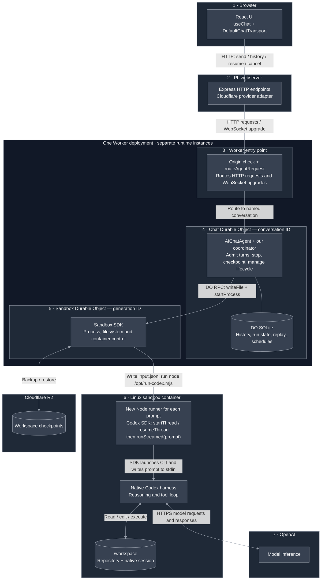
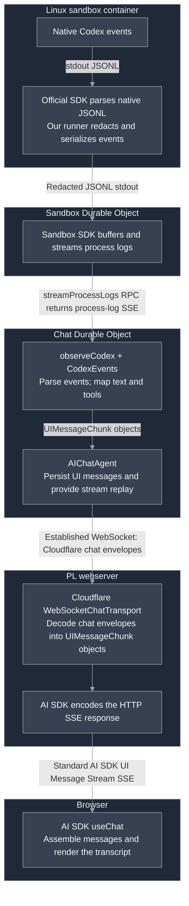
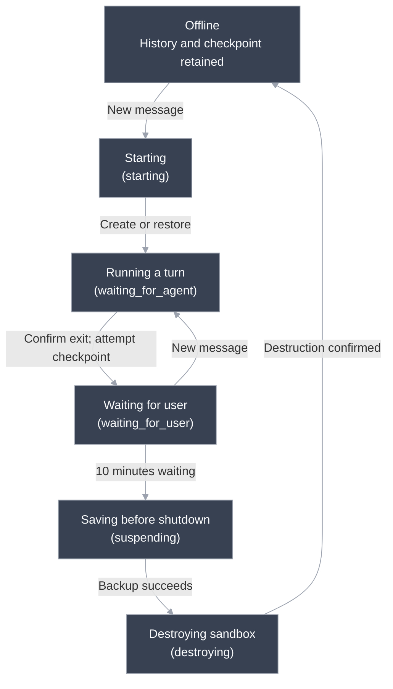

# Persistent Codex prototype

A local React UI chats through a replaceable Express server with native Codex running in a Cloudflare Sandbox. The conversation survives browser/server disconnection; workspace recovery uses checkpoints.

**Status:** local tests pass using a simulated sandbox. Real Cloudflare containers, Codex execution, and R2 restoration still need live verification. [Setup and smoke tests](../README.md).

## Key decisions

- **Codex owns the agent loop.** One runner process per user prompt; subsequent prompts resume the native thread.
- **The Chat DO owns coordination and history.** The PL server holds no durable execution state.
- **The browser uses standard AI SDK HTTP/SSE.** The backend adapter handles Cloudflare WebSockets.
- **Disconnection is not cancellation.** Reconnect to replay output; use Stop to cancel execution.
- **Recovery restores files, not running processes.** Interrupted prompts are never automatically repeated.

This documents the current implementation: keep-alive, ten-minute waiting-state cleanup, and an absolute six-hour sandbox lifetime. The discussed switch to Cloudflare-only idle shutdown is **not implemented**.

## Architecture

Read top to bottom. **3, 4, and 5 are deployed together:** the Worker module exports the entry point, our `Chat` class, and the SDK’s `Sandbox` class; Wrangler registers their DO bindings and migrations. Each DO instance has its own identity, state, and lifetime. The grouping is a deployment boundary, not one process. The Linux container is a separate runtime.

The Worker routes HTTP requests and WebSocket upgrades; it is not our per-message relay after connection.

**We drive Codex one turn at a time:**

1. **Chat DO → Sandbox DO:** Sandbox SDK RPC calls write the prompt/thread ID to `input.json` and start `node /opt/run-codex.mjs <run-dir>`.
2. **Runner → Codex:** the runner reads that file and calls the official SDK’s `startThread`/`resumeThread`, then `runStreamed(prompt)`. The SDK launches the native CLI, writes the prompt to its stdin, and closes stdin. Codex owns all model/tool iterations until the turn ends; the runner then exits.
3. **Sandbox DO → Chat DO:** the Chat DO calls `streamProcessLogs(run.id)`. The returned stream carries buffered/live stdout in SSE log envelopes; `observeCodex` extracts JSONL and maps events for the UI.

There is **no persistent stdin pipe between the DOs**. The input path is file + process RPC; stdin is local to the SDK’s native subprocess. The same warm sandbox and native session can span many runner processes.

### Code ownership

| Surface                                                                                                        | We own                                                                      | Library/service owns                                           |
| -------------------------------------------------------------------------------------------------------------- | --------------------------------------------------------------------------- | -------------------------------------------------------------- |
| [React client](../apps/web/client/App.tsx)                                                                     | Transcript UI, history loading, reconnect, Stop                             | AI SDK message state and SSE consumption                       |
| [Express relay](../apps/web/server/server.ts) + [provider adapter](../apps/web/server/providers/cloudflare.ts) | Routes, validation, connection lifetime                                     | Express HTTP; Cloudflare chat transport; AI SDK SSE encoding   |
| [Chat coordinator](../apps/agent/agent.ts)                                                                     | Admission, cancellation, lifecycle, checkpoint ordering                     | `AIChatAgent` history/replay; Agents durable scheduling        |
| [Sandbox bridge](../apps/agent/codex.ts) + [event mapper](../apps/agent/codex-events.ts)                       | Process/file calls and Codex → UI translation                               | Sandbox execution, log streaming, backup/restore               |
| [Runner](../apps/agent/run-codex.mjs)                                                                          | Input/result files, duplicate-launch claim, cancellation watcher, redaction | Official Codex SDK subprocess handling; native model/tool loop |

### Response path

These are the same runtimes as above. **Process-log SSE and browser SSE are different protocols**; the Chat DO translates between them.

The mapper handles assistant text, commands, and file changes. Text arrives on completed assistant items, not token by token. Its Zod validation covers a subset of native events; the JavaScript runner is not an end-to-end generated typed protocol.

## Request contract

The [shared contract](../packages/chat-contract/src/index.ts) defines these provider-independent operations using AI SDK message types:

| Endpoint                          | Behavior                                                              |
| --------------------------------- | --------------------------------------------------------------------- |
| `POST /api/chat`                  | Validate `UIMessage[]`, submit through the adapter, return AI SDK SSE |
| `GET /api/chat/history`           | Return persisted UI messages                                          |
| `GET /api/chat/playground/stream` | Attach to buffered/live output; 204 if none                           |
| `POST /api/chat/cancel`           | Request explicit stop; report unconfirmed cleanup as an error         |

The coordinator sends only the latest user text to `runStreamed`; native session files carry previous context. A **turn** includes every model call and tool action for that prompt. The runner exits after the turn.

The adapter uses `cancelOnClientAbort: false`. Replacing the relay requires only the same `AGENT_URL`; reconnection does not resubmit the prompt.

## Global state machine

The Chat DO persists this lifecycle. The diagram shows the normal path; exception behavior follows. `offline` means `state.sandbox` is absent.

### Lifecycle rules

| Trigger                  | Behavior                                                                              |
| ------------------------ | ------------------------------------------------------------------------------------- |
| New message              | Reuse a warm sandbox or restore a cold one; reject overlapping turns                  |
| Turn ends                | Confirm exit, save native thread ID, attempt checkpoint, enter `waiting_for_user`     |
| Stop                     | Runner aborts the SDK signal; wait up to five seconds for exit, without force-killing |
| Ten minutes waiting      | Checkpoint, then destroy; a new turn invalidates the old idle timer                   |
| Six-hour sandbox age     | Abort observation and destroy, even mid-turn, without requiring a fresh checkpoint    |
| Browser/relay disconnect | No execution or lifecycle transition                                                  |

Keep-alive remains enabled during work and waiting. `sleepAfter: "6h"` is only a fallback once keep-alive is disabled. Runner timeout, process timeout, and durable destruction all target the same absolute deadline; new turns do not reset it.

Only `offline` and `waiting_for_user` normally accept new work. Stopping and turn-end checkpointing remain within `waiting_for_agent`. Run outcomes (`completed`, `cancelled`, `failed`, `interrupted`) are separate from sandbox phases.

### Failure behavior

| Failure                               | Recovery                                                                                                           |
| ------------------------------------- | ------------------------------------------------------------------------------------------------------------------ |
| Stop unconfirmed                      | Keep run active; block new turns until confirmed exit or lifetime cleanup                                          |
| Turn-end backup fails                 | Report error; preserve warm workspace and previous checkpoint                                                      |
| Idle backup/destruction fails         | Return to waiting; at most three attempts, 30 seconds apart                                                        |
| Lifetime destruction fails            | Record `cleanup_failed`; attempt to release keep-alive; same bounded retries, then explicit retry on a new message |
| Chat DO restarts mid-turn             | Stop surviving work and checkpoint when possible; no automatic prompt replay                                       |
| Container or output stream disappears | Report interruption/failure and attempt cleanup; cold recovery uses the last checkpoint                            |
| Restore fails or backup expires       | Surface error; no automatic reconstruction from chat history                                                       |

Destruction must be confirmed before intentionally replacing a generation. Timers check the generation ID; idle timers also check `waitingSince`. Late callbacks/backups cannot overwrite a replacement's state. An unexpected cold restart does not extend the recorded lifetime. Cloudflare outages can delay destruction; there is no separate cleanup sweeper.

## Persistence

| Data                                                                     | Location                                 | Survives container loss?                |
| ------------------------------------------------------------------------ | ---------------------------------------- | --------------------------------------- |
| UI history, replay, latest run, generation, schedules, checkpoint handle | Chat DO SQLite (not D1 or PL PostgreSQL) | Yes                                     |
| Repository and native Codex session                                      | `/workspace/repo`, `/workspace/codex`    | Only through a successful R2 checkpoint |
| Runner input, claim, cancel marker, result, diagnostics                  | `/tmp`                                   | No                                      |
| Workspace backups                                                        | R2                                       | Yes, until expiry                       |

Checkpoints pair workspace files with their native thread ID. The thread ID alone cannot restore a conversation. Backups happen after confirmed stop and before idle destruction; no shutdown hook is assumed to save work on abrupt loss.

**UI history and workspace backups are not atomic.** After recovery, history may describe edits absent from the last checkpoint. Launch claims prevent common duplicate execution in a surviving container; they do not provide exactly-once tool side effects.

Backups expire after **30 days**; an R2 lifecycle rule must delete old objects. This differs from the Course agent MVP's seven-day policy.

## Security and known gaps

**Trusted prototype only:** one shared `playground` conversation, one configured container instance, an initially empty Git repository, and no application authentication. Origin checks are not authorization.

- The OpenAI key is injected into the runner environment. Auth storage is ephemeral; default shell-tool environments omit the key; known-key strings are redacted before runner output is persisted.
- These measures do not isolate credentials from hostile container code. Workspace/native session backups are not comprehensively scrubbed. Auth and diagnostic paths are excluded from backups.
- Two simultaneous chat windows through different relays are **untested**; idle windows do not automatically discover new turns elsewhere.
- No course checkout/sync, publishing approvals, preview servers, usage accounting, or credential-injecting outbound proxy.
- Native `workspace-write` compatibility, real child-process cancellation, R2 restore, and live lifecycle alarms remain unverified. Backup cost/latency and warm-session artifact growth are unmeasured.

## Deployment and replacement

**Two deployments:** `apps/web` serves React and Express; `apps/agent` deploys the Worker, DO classes, and container image. `packages/chat-contract` is shared source, not a service. [Deployment instructions](../README.md#cloudflare-setup--you-perform-these-steps).

To replace Cloudflare, implement the same history/send/resume/cancel provider interface and replace `apps/agent`. Preserve durable history, subscriber-independent execution, reattachment, cancellation, and workspace recovery. The frontend can stay; the adapter and persisted data require migration.

## Validation

[Codex tests](../apps/agent/test/codex.test.ts) cover mapping, runner subprocess behavior, cancellation, and remaining-lifetime timeouts. [Relay integration tests](../apps/web/test/relay.mjs) use the real local chat runtime with a deterministic sandbox fixture for reconnection, restoration, lifecycle, stale timers, and failure handling. Clock advancement tests policy, not actual six-hour cloud execution.

Run `pnpm test`; complete the [live acceptance steps](../README.md#try-it) before relying on the deployment. The broader [Course agent MVP](https://github.com/PrairieLearn/PrairieLearn/issues/15681) remains future work, particularly durable approval/publishing flows across sandbox loss.
