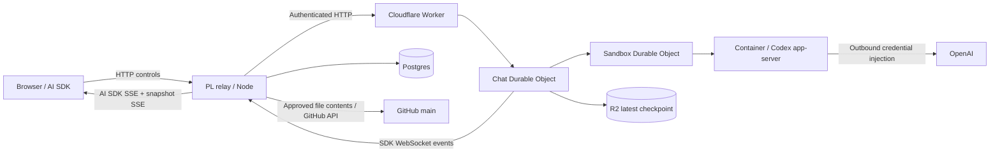
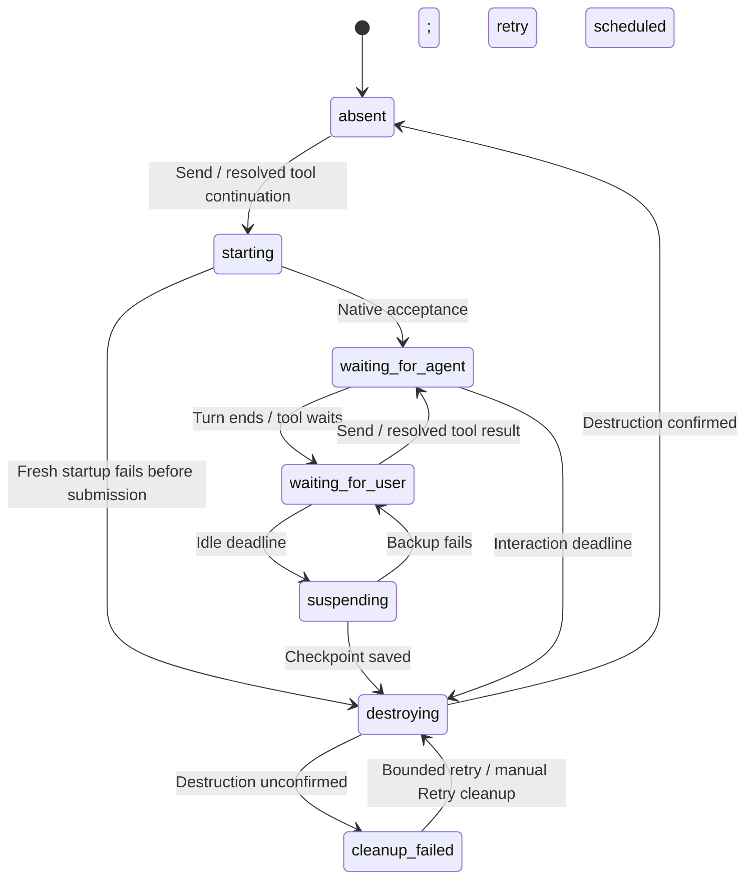
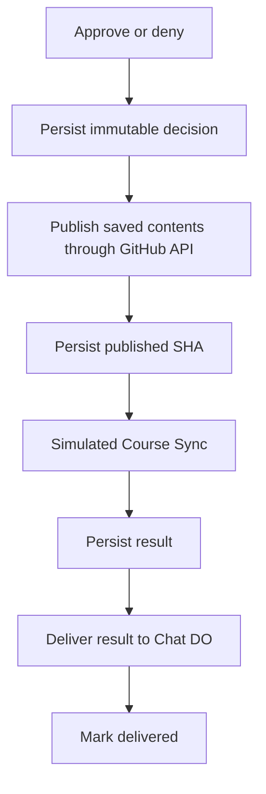

# Course-agent prototype architecture

This prototype exercises sandbox isolation, durable chat, approval recovery, and trusted publication. It does not implement PrairieLearn authorization or real Course Sync.

```mermaid
flowchart LR
  Browser[Browser / AI SDK] -->|HTTP controls| Relay[PL relay / Node]
  Relay -->|Authenticated HTTP| Worker[Cloudflare Worker]
  Worker --> Chat[Chat Durable Object]
  Chat --> Sandbox[Sandbox Durable Object]
  Sandbox --> Codex[Container / Codex app-server]
  Codex -->|Outbound credential injection| OpenAI[OpenAI]
  Chat -->|SDK WebSocket events| Relay
  Relay -->|AI SDK SSE + snapshot SSE| Browser
  Relay --> Postgres[(Postgres)]
  Chat --> R2[(R2 latest checkpoint)]
  Relay -->|Approved file contents / GitHub API| GitHub[GitHub main]
```

## Ownership

| Component  | Owns                                                                                                                     | Does not own                                             |
| ---------- | ------------------------------------------------------------------------------------------------------------------------ | -------------------------------------------------------- |
| Browser    | Draft, acknowledged revision, rendering and countdown                                                                    | Authoritative state or approval execution                |
| PL relay   | Conversation catalog, admission revisions, course configuration, immutable proposals, decisions and publication progress | Chat history, native Codex execution, sandbox scheduling |
| Postgres   | Shared relay state and cross-server change notifications                                                                 | Model conversation history                               |
| Worker     | Authentication and routing to the named Chat DO                                                                          | A separate execution loop                                |
| Chat DO    | UI history, generic pending-tool gate, native thread identity, lifecycle and replay                                      | GitHub writes, course sync, user approval verdict        |
| Sandbox DO | Cloudflare container operations and outbound policy                                                                      | Conversation admission or product authorization          |
| Codex      | Reasoning, tools and native conversation history                                                                         | Trusted publication to the course repository             |

UI history never replaces native Codex history. The adapter maps app-server notifications into AI SDK chunks for display and persistence. A resolved tool result can become a hidden continuation when the original native RPC no longer exists; that is explicit result delivery, not replay of UI history.

## Requests and event streams

1. A tab sends an operation UUID, text and its acknowledged revision to the relay.
2. Postgres locks the conversation row, checks the expected revision, and records the operation with one revision increment. An identical retry retains that revision; a reused ID with different input is rejected.
3. The relay forwards the admitted message. The DO decides whether to start or steer, deduplicates message IDs, and rejects lifecycle conflicts or an unresolved tool gate.
4. If forwarding fails after admission, the revision remains reserved. The user sees an error and refreshes; no background message replay is attempted.
5. The AI SDK stream carries tokens. A separate SSE subscription carries snapshots and lifecycle diagnostics. The relay listens to Cloudflare's existing state/history broadcasts and Postgres `LISTEN/NOTIFY`.
6. Both subscriptions are installed before the first snapshot is read. Changes arriving during a read schedule another serialized read. Reconnection establishes new subscriptions and reads a fresh snapshot.

The browser keeps its acknowledged revision separate from the latest server revision. Events update what it can see, but do not silently authorize a stale draft. There are no browser snapshot or diagnostics polling loops. The one-second countdown is local rendering only.

## Lifecycle

```mermaid
stateDiagram-v2
  [*] --> absent
  absent --> starting: Send / resolved tool continuation
  starting --> waiting_for_agent: Native acceptance
  starting --> destroying: Fresh startup fails before submission
  waiting_for_agent --> waiting_for_user: Turn ends / tool waits
  waiting_for_user --> waiting_for_agent: Send / resolved tool result
  waiting_for_user --> suspending: Idle deadline
  suspending --> destroying: Checkpoint saved
  suspending --> waiting_for_user: Backup fails; retry scheduled
  destroying --> absent: Destruction confirmed
  destroying --> cleanup_failed: Destruction unconfirmed
  cleanup_failed --> destroying: Bounded retry / manual Retry cleanup
  waiting_for_agent --> destroying: Interaction deadline
```

Idle cleanup applies equally to an ordinary pause and a pending approval. The current short idle constant remains a manual testing setting. Interaction expiry is six hours since the last user interaction. Both use durable schedules, so they survive DO eviction.

A planned suspension stops active execution, saves `/workspace`, and destroys the sandbox. Only the latest checkpoint is retained, with a seven-day TTL. Replacement backup data is committed before superseded data is removed. There is no per-turn backup.

A failed fresh startup is disposable only before prompt submission and when no checkpoint is being restored. Warm/restored work is preserved. Lifecycle guards fence each asynchronous setup operation and close newly acquired connections if a concurrent expiration invalidates the generation. A request timeout alone does not cancel in-flight setup.

Unexpected container loss is detected through connection/operation failures and native reconciliation. There is no health-polling loop or automatic replay of an uncertain prompt. A later explicit message restores the latest usable checkpoint. Missing/expired checkpoints produce a visible warning before a fresh workspace is initialized; transient storage failures retain the checkpoint.

Cleanup diagnostics report stage, attempts, sanitized errors and retry time. Destruction is not reported as successful until acknowledged. Cleanup has bounded retries; manual Retry cleanup remains available. Backup failure at the final interaction deadline can result in destruction with a retained data-loss warning.

## Durable tools and approval

The DO persists a generic request ID, tool name and immutable payload before the native tool waits. The payload is transport data; the relay owns the approval record and verdict. `push_sync` captures committed text blobs, deletions, file modes and a raw diff from immutable Git objects, not from the changing worktree.

The relay persists the proposal in Postgres. In real publication mode it retrieves base blobs from GitHub, validates paths/modes and reconstructs the displayed raw diff from the same saved final contents that will be published. It never applies the sandbox's diff as executable publication instructions. The content digest is stable across JSONB key ordering.

An unresolved gate blocks ordinary Send/steer in both warm and recovery paths. An approval can outlive sandbox destruction. Once a result exists, the DO either responds to the live native tool or resumes the saved thread with a hidden result message. The browser keeps the decision card at its original transcript location.

## Publication and explicit Retry

```mermaid
flowchart TD
  Decide[Approve or deny] --> Save[Persist immutable decision]
  Save --> Push[Publish saved contents through GitHub API]
  Push --> SHA[Persist published SHA]
  SHA --> Sync[Simulated Course Sync]
  Sync --> Outcome[Persist result]
  Outcome --> Deliver[Deliver result to Chat DO]
  Deliver --> Done[Mark delivered]
```

Denial skips publication and sync. Simulation mode skips the real GitHub write. In real mode, GitHub `createCommitOnBranch` atomically creates the commit and advances the existing branch using `expectedHeadOid`. The prototype requires an initialized main branch and ordinary UTF-8 text files; executable-mode changes, symlinks, submodules and GitHub configuration changes are rejected.

There is no Git checkout, patch file or Git subprocess on the relay. Git commands still run inside the sandbox for exploration and capture.

A publication operation ID and content digest identify its commit. After an uncertain response, Retry searches branch history for that exact operation before writing again, including when main has advanced. Concurrent unrelated changes are rejected rather than overwritten. Force-push rewriting published history is outside the prototype's supported workflow.

Postgres session advisory locks serialize concurrent completion attempts across relay processes. Connection loss releases the lock. Each external stage is followed by a durable progress write. Results remain pending until the DO acknowledges delivery, and repeated delivery is deduplicated by the DO.

Failures are visible as approved-but-incomplete operations with a Retry completion button. There is deliberately no publication/delivery polling loop: the user refreshes and explicitly retries. Simulated sync can run again safely. Real PrairieLearn sync must provide equivalent repeatability before integration.

## Credentials and deployment

Model and Git read credentials are injected by the outbound handler, outside the sandbox. Only configured destinations are allowed. The relay holds the repository write token and publishes only after approval. Neither token belongs in checkpoints or chat events.

Local development runs the same Worker/DO code, a local container and a separate Postgres database. Cloudflare deployment retains a local relay for testing; configure its `AGENT_URL` to the deployed Worker. This change does not deploy automatically.

## Remaining scheduled work

- DO idle and interaction deadlines.
- Bounded failed-cleanup and obsolete-checkpoint deletion retries.
- Transport reconnects/timeouts and the browser's local countdown.

No recurring publication scan, browser history polling, diagnostics polling, or sandbox health probe is added.
