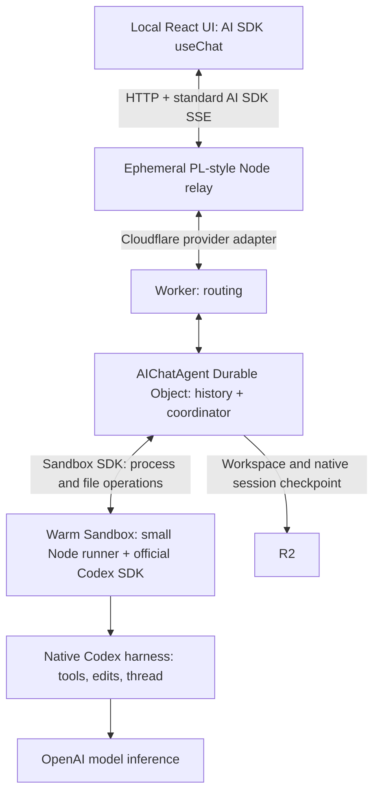

# Implemented design: warm Sandbox + official Codex SDK

Implemented locally. Cloudflare deployment and a real Codex/container/R2 smoke test remain user-run; see [setup and acceptance steps](../README.md).

## Ownership

| Component                             | Owns                                                                           |
| ------------------------------------- | ------------------------------------------------------------------------------ |
| AI SDK React                          | Chat UI state and standard SSE consumption                                     |
| PL relay + provider adapter           | Existing HTTP interface and Cloudflare transport; no durable run state         |
| Cloudflare `AIChatAgent`              | UI transcript persistence, client replay, and chat turn handling               |
| Our coordinator (`agent.ts`)          | One run at a time, explicit stop, cleanup deadline, checkpoint ordering        |
| Our sandbox bridge (`codex.ts`)       | Sandbox process streaming, cancellation marker, backup/restore calls           |
| Our event adapter (`codex-events.ts`) | SDK events → AI SDK text/tool events; no reasoning displayed                   |
| Official Codex SDK                    | Start/resume native threads, stream typed events, subprocess/protocol handling |
| Native Codex                          | Agent loop, tool execution, edits, compaction, session files                   |
| Cloudflare Sandbox + R2               | Container lifecycle and workspace backup/restore primitives                    |

No OpenAI Agents API, app-server service, container HTTP server, queue, custom React hook, or custom model/tool loop. The TypeScript SDK invokes the local native CLI; it runs inside the Sandbox, not inside the Worker.

## Normal turn

1. Save a run ID and durable cleanup deadline before launching work.
2. Enable keep-alive. Reuse the warm workspace; restore the last checkpoint only when the container is cold.
3. Start the small Node runner. It calls `startThread` or `resumeThread`, then `runStreamed` for only the new prompt. Credentials arrive through the process environment.
4. Consume buffered/live stdout through Cloudflare’s process-log stream and translate SDK events for `AIChatAgent`. Browser/relay disconnection does not cancel the turn. A process-stream failure reports interruption without replaying the prompt.
5. Confirm the process has stopped, checkpoint `/workspace` (repository and native Codex session), then release keep-alive. Cloudflare may sleep the container after two idle minutes.

The runner writes one final outcome (`completed`, `failed`, `cancelled`, or `timed-out`) and a separate native thread-ID file. The Worker waits for process exit before reading the outcome; a stopped process without an outcome is interrupted. The event mapper only formats UI text and tool activity.

The coordinator saves the native thread ID before attempting backup, so a failed backup does not lose the warm session. Each successful checkpoint also records its corresponding thread ID for cold restore. A native thread ID alone cannot restore a lost filesystem. The UI transcript is separate from the native session.

## Deliberately simple interruption behavior

- **Browser or PL server disappears:** the existing Cloudflare chat stream continues. Another PL server can reconnect through the existing adapter.
- **Stop button:** write a marker watched by the runner, which aborts the official SDK signal. Wait at most five seconds for exit without escalating to a kill. If exit is unconfirmed, keep the run active and block new work until completion or deadline cleanup. Checkpoint only after the process stops.
- **Chat Durable Object restarts:** stop any surviving work, checkpoint if the workspace still exists, save an interruption message, and let the user send a new prompt. Disable the chat library's automatic continuation/retry.
- **Container disappears:** report interruption. The next turn restores the last successful checkpoint. In-progress changes may be lost.
- **Deadline:** the SDK aborts at ten minutes; Sandbox process timeout and a durable coordinator deadline provide cleanup. Both live and orphaned deadline cleanup record a failed run. The observer does not maintain another deadline. If stop cannot be confirmed, block new work and retry cleanup.
- **Checkpoint fails:** report failure and release keep-alive. The warm workspace can still be used until it sleeps, but only the previous checkpoint is durable.

There is no transparent execution recovery, exactly-once side-effect claim, or automatic prompt replay. An atomic run-directory claim prevents a duplicate launch of the same run in the surviving container.

## Credential boundary

The runtime key reaches the native harness, not its default shell-tool environment. Auth storage is ephemeral. Known-key redaction happens before stdout and result persistence; run artifacts and diagnostic file logs live in `/tmp`, outside the workspace checkpoint. Legacy auth/log/run paths remain excluded. Native sessions and repository files are still sensitive: they are not rewritten or scrubbed by our mapper. See the README for the precise limits.

## What remains to prove in Cloudflare

Local tests use the real chat coordinator and a deterministic Sandbox substitute, plus the real Codex SDK with a fake native executable. They exercise relay replacement, SDK cancellation, interrupted coordinator cleanup, cold restore, and backup failure.

The user must still verify the Linux image, Codex `workspace-write` compatibility, termination of real child commands, real R2 backup/restore, and paid model access. Setup stays user-owned. Preview web servers, multiple conversations, interactive approvals, and production authentication are outside this increment.
