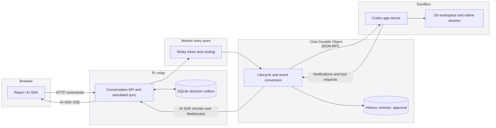
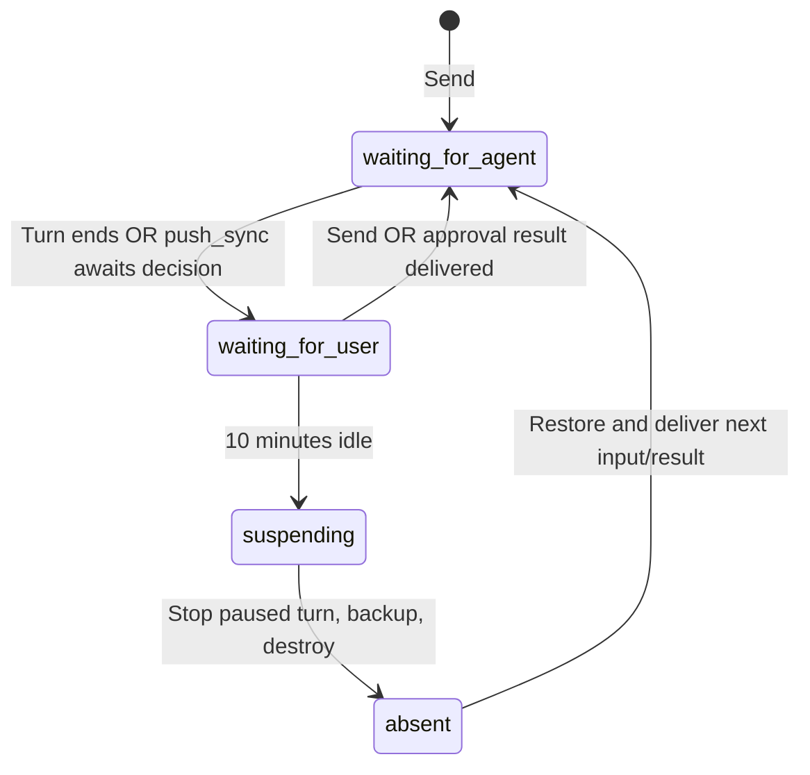

# Conversations, transcripts and durable approvals

## Responsibilities

| Surface                    | Responsibility                                                                                                                                                        |
| -------------------------- | --------------------------------------------------------------------------------------------------------------------------------------------------------------------- |
| React / AI SDK             | Resume/render UI messages; render reasoning summaries and steering markers; keep drafts in per-tab session storage; show revision conflicts and approval diff/buttons |
| PL relay                   | Conversation catalog, request routing, approval-gated Git publisher and simulated sync, durable result-delivery outbox                                                |
| Chat DO                    | Authoritative revision, chat history, immutable pending diff and digest, decisions, sandbox lifecycle, conversion to AI SDK chunks                                    |
| Codex app-server           | Model/tool loop, native steering, dynamic `push_sync` calls and live tool results                                                                                     |
| Sandbox / outbound handler | Workspace and native session; repository-scoped read-only Git credential injection                                                                                    |

The relay uses Node's built-in SQLite with WAL, under `apps/web/.data/chat.sqlite` by default (`CHAT_DB_PATH` overrides it). This is durable across process restarts, but is a **single-host prototype store**. PrairieLearn integration must move the catalog and decision outbox to its shared PostgreSQL database and authorize every conversation against the user/course. Do not expose the localhost relay as a public service.

## Admission and transcript ordering

`POST /api/conversations/:id/chat` accepts `{id, text, expectedRevision}`. The Chat DO serializes controls. It checks duplicate message IDs first, then compares the revision, and reserves the next revision before async native submission. An uncertain or rejected submission can therefore advance the revision: the client must review history before trying again. Model token chunks do not change this counter.

`GET .../chat/snapshot` returns messages, revision, approval, and whether sending is blocked. A two-second frontend poll observes changes from other tabs even without an attached stream. It does not silently update the draft's revision. Refresh explicitly accepts the latest revision and preserves the draft. A stale POST receives 409 even if the browser did not notice the change yet.

A successful native steer emits a persistent `data-steering` part with the user-message ID and text at its acknowledgment point. Open text/reasoning parts close before that marker, and subsequent deltas create new segments. The separately persisted user message remains the canonical input; the renderer hides its duplicate when a marker exists. This shows **acceptance ordering**, not a guarantee that Codex acted on the instruction before every subsequent notification. If acceptance is lost before the marker is persisted, the ordinary user message remains the fallback.

Reasoning uses Codex's `summaryTextDelta` / completed summary items and AI SDK `reasoning-*` chunks. The UI labels it “Reasoning summary.” Availability depends on the model; this does not expose private raw chain of thought. `turn/start` requests `summary: auto`.

The legacy `/api/chat` paths still route to `playground`. New clients should use the conversation-scoped paths. `GET/POST /api/conversations` lists/creates catalog entries; each ID maps to a distinct Chat DO and native thread.

## Approval state is separate from sandbox state

Approval status is independently `pending`, `approved`, or `denied`; a delivery flag blocks new messages until the decision is handed back. There is no `waiting_for_approval` lifecycle state. Reading the diff, polling, and reconnecting do not reset idle time.

1. Codex commits its proposed local changes and calls `push_sync({baseSha, proposedSha})` with full commit SHAs. This avoids silently omitting untracked/uncommitted work from review.
2. The DO captures `git diff --no-ext-diff --no-textconv --binary base proposed`, limits the stored diff to 256 KiB, hashes the SHAs and diff, and persists an immutable approval. The native tool call waits; the lifecycle becomes `waiting_for_user` with the existing ten-minute alarm.
3. The browser renders the saved diff as escaped text. The PL relay validates the patch against the configured remote before enabling approval. It pins the destination and candidate commit in SQLite, records the decision, and performs a real non-force Git push. Only Course Sync remains the **“sync would go here”** printout.
4. The relay delivers that result to the DO. The outbox retries undelivered results after a relay restart or transient failure. Operation IDs make repeated delivery idempotent. The DO rejects changed digests, stale pending decisions, and conflicting decisions.
5. If the native tool call is still connected, the result is its original tool output and execution continues. If the sandbox already stopped, the DO restores the checkpoint and starts a continuation on the same native thread containing the operation ID and persisted result.
6. Before idle destruction, a live waiting tool receives a “decision pending; pause” response and the native turn is interrupted. Backup occurs only after Stop is confirmed. The durable diff and decision remain outside the sandbox. If checkpointing fails, existing bounded idle-cleanup retries retain the sandbox.

A cold continuation is deliberately a new turn, **not** resurrection of an old JSON-RPC request. Unexpected loss still restores only the last successful checkpoint; the diff remains reviewable even if the proposed workspace files were never backed up. Accepted but uncertain native execution is not blindly replayed.

### Real publication boundary

See [real-push setup and constraints](push-sync-testing.md). PL applies the stored patch in an isolated Git index, rejects unsupported files, verifies the remote base before review and push, and publishes only after approval. The sandbox still cannot authenticate a push. PL and the Worker share one repository-scoped read/write PAT; the Worker permits only read-only Git requests from the sandbox. Production integration still requires shared durable storage and course-owner authorization; this local prototype uses one trusted user.

## Git and credentials

Set Worker variable `GITHUB_REPOSITORY=owner/repository` (without `.git`) and Worker secret `GITHUB_TOKEN` using a fine-grained GitHub token with Contents: Read and write for that repository. Configure the same `GITHUB_TOKEN` on the PL relay for approved pushes; the Worker still restricts sandbox traffic to read-only Git endpoints. New sandboxes clone it into `/workspace/repo`. Existing warm workspaces/backups are not rewritten; create a new conversation to change the course repository.

The outbound handler injects Basic authorization outside the sandbox for exactly the repository's smart-HTTP `info/refs?service=git-upload-pack` and `git-upload-pack` endpoints. This covers HTTPS clone/fetch/pull. It denies pushes, other repositories, redirects, SSH, Git LFS, submodules on other repositories, and arbitrary GitHub API requests. The prototype has **one configured course repository per Worker deployment**; conversation isolation does not imply separate repository scopes. The token never goes into a container environment, Git config, backup, or tool result.

Production Worker HTTP and WebSocket entry points require a shared `RELAY_TOKEN`. Set the same value in the relay environment; it is never sent to the browser. `LOCAL_DEV=true` permits unauthenticated local Wrangler access. This shared service token is not a substitute for future PL user/course authorization.

## Manual testing

1. Install dependencies with `pnpm install --frozen-lockfile`. Keep using the existing Docker/Worker/relay/UI setup in [testing.md](testing.md).
2. For local inference, put `CODEX_API_KEY`, optionally `GITHUB_TOKEN`, and `GITHUB_REPOSITORY` in ignored `apps/agent/.dev.vars`. Run `pnpm dev:agent`, `pnpm dev:server:local`, and `pnpm dev` in separate terminals. No deployment is required.
3. For Cloudflare, add `GITHUB_REPOSITORY` to Worker vars if testing a real repository; set `GITHUB_TOKEN` and `RELAY_TOKEN` using `wrangler secret put`. Put the same `RELAY_TOKEN` in root `.env.local`. Manually run `pnpm deploy`, then restart `pnpm dev:server`. The new relay authentication requirement is intentional; an old relay without the token receives 401.
4. Click **New conversation**. Existing native threads keep their original dynamic-tool definitions; use a new thread for `push_sync` testing. Ask it to do a multi-step task, send a correction while active, and inspect the steering marker and optional reasoning summary. Reload and check persistence.
5. Duplicate the tab. Send in one tab. The other should report stale state, retain any draft, and disable Send until **Refresh history**. Create another conversation and confirm its history is independent.
6. With a configured repository, ask for `git fetch origin` / `git pull --ff-only`; check success. Requests to another repository or push endpoints must fail. Credentials must not appear in the remote URL or environment.
7. Ask: “Create and commit a small text change. Use the commit before the change as baseSha and the new commit as proposedSha. Call push_sync and wait for my decision.” If no repository is configured, first ask it to initialize a base commit and set a local Git author identity.
8. Review the diff. Approve while warm: the relay performs the real push, prints the fake sync, and Codex receives the tool result. Repeat with Deny, which must leave GitHub unchanged.
9. Create another proposal, leave it pending for ten minutes, and verify diagnostics become absent. Refresh: diff/buttons must still exist. Approve/deny, verify restore and the continuation informing Codex of the result. Retry delivery/reload must not duplicate the operation or continuation. Restart the relay during delivery to exercise the outbox.

Automated tests use the actual pinned app-server with a fake model and the actual DO/chat runtime with a simulated sandbox. Cloudflare HTTPS Git interception, paid inference, and real R2 restore still require the manual checks above. The prototype does not add billing quotas, distributed multi-relay storage, or PrairieLearn user/course authorization. Read [push-sync-testing.md](push-sync-testing.md) before live push testing.
